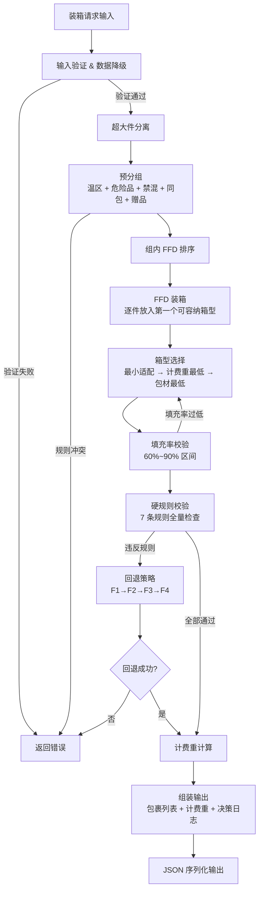
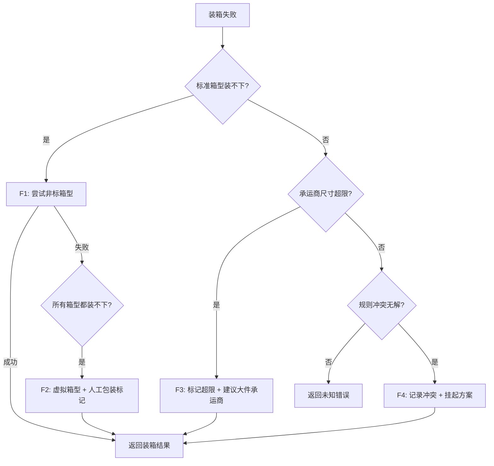

# 设计文档：装箱计算引擎

## 概述

装箱计算引擎（Cartonization Engine）是智能分仓决策系统的核心模块，位于候选仓确定之后、运费计算之前。引擎接收订单 SKU 列表、可用箱型库和承运商限制，按照物理约束和业务规则将商品装入标准箱型，输出包裹列表及每个包裹的计费重量。

### 设计目标

1. **正确性**：严格执行 7 条硬规则，零违反
2. **高效性**：使用 FFD 启发式算法，在 O(n log n) 时间内完成装箱
3. **可扩展性**：硬规则以独立 Validator 实现，方便新增规则
4. **可观测性**：每次装箱输出完整决策日志（分组原因、箱型选择原因、拆包原因）
5. **容错性**：4 级回退策略，装箱成功率目标 ≥ 95%

### 技术栈

- 语言：Python 3.11+
- 序列化：Pydantic v2（数据模型 + JSON 序列化/反序列化）
- 测试：pytest + hypothesis（属性测试）
- 无外部框架依赖，作为独立模块运行

## 架构

### 系统上下文

```
候选仓确定 → 【装箱计算引擎】 → 运费计算 → 综合成本 → 方案排序
```

装箱引擎的输出直接决定：
- 包裹数量（影响拆单惩罚 `SplitPenaltyFactor`）
- 每个包裹的计费重（影响运费 `Freight_base`）
- 承运商可用性（超规则淘汰承运商）

### 执行流水线



### 模块划分

| 模块 | 职责 | 对应需求 |
|------|------|----------|
| `validator` | 输入验证 & 数据降级 | 需求 1 |
| `pre_grouper` | 预分组（温区、危险品、禁混、同包、赠品） | 需求 2 |
| `sorter` | FFD 体积排序 | 需求 3 |
| `packer` | FFD 装箱核心算法 | 需求 3 |
| `box_selector` | 箱型匹配与选择 | 需求 4 |
| `splitter` | 多包拆分 | 需求 5 |
| `fill_rate_checker` | 填充率校验 | 需求 6 |
| `hard_rule_checker` | 7 条硬规则校验 | 需求 7 |
| `billing_calculator` | 计费重量计算 | 需求 8 |
| `fallback_handler` | 4 级回退策略 | 需求 10 |
| `oversize_handler` | 超大件处理 | 需求 11 |
| `models` | 数据模型（Pydantic） | 需求 9, 12 |
| `engine` | 流水线编排入口 | 全部 |


## 组件与接口

### 1. 引擎入口 (`CartonizationEngine`)

```python
class CartonizationEngine:
    def cartonize(self, request: CartonizationRequest) -> CartonizationResult:
        """
        装箱计算主入口。
        按流水线顺序执行：验证 → 超大件分离 → 预分组 → FFD装箱 → 箱型选择
        → 填充率校验 → 硬规则校验 → 计费重计算 → 组装输出。
        """
        ...
```

### 2. 输入验证器 (`InputValidator`)

```python
class InputValidator:
    def validate(self, request: CartonizationRequest) -> ValidationResult:
        """
        验证输入完整性，对缺失字段执行降级策略。
        返回验证结果，包含降级标记列表。
        """
        ...

    def _apply_degradation(self, sku: SKUItem) -> list[DegradationMark]:
        """对缺失字段应用品类平均值或默认值。"""
        ...
```

**降级策略映射**：
| 缺失字段 | 降级值 | 标记 |
|----------|--------|------|
| weight/length/width/height | 品类平均值 | `DATA_DEGRADED` |
| temperature_zone | `常温` | `DATA_DEGRADED` |
| hazmat_type | `无` | `DATA_DEGRADED` |

### 3. 预分组器 (`PreGrouper`)

```python
class PreGrouper:
    def group(self, items: list[SKUItem], config: OrderConfig) -> list[SKUGroup]:
        """
        按规则将 SKU 分为互斥组。
        执行顺序：超大件分离 → 温区分组 → 危险品隔离 → 禁混拆分 → 同包合并 → 赠品绑定。
        冲突时抛出 RuleConflictError。
        """
        ...
```

**分组规则优先级**（高→低）：
1. 超大件分离（`oversize_flag=True` 的 SKU 直接单独成组）
2. 温区隔离（按 `temperature_zone` 分组）
3. 危险品隔离（`hazmat_type != 无` 的 SKU 单独成组）
4. `cannot_ship_with` 互斥拆分
5. `must_ship_with` 绑定合并
6. 赠品同包（`gift_same_package_required=True` 时）

### 4. FFD 装箱器 (`FFDPacker`)

```python
class FFDPacker:
    def pack(self, group: SKUGroup, box_types: list[BoxType],
             carrier_limits: CarrierLimits) -> list[Package]:
        """
        对一个预分组执行 FFD 装箱。
        1. 按体积降序排序（体积相同按重量降序）
        2. 逐件尝试放入第一个可容纳的已开箱
        3. 无法放入则开新箱
        """
        ...
```

### 5. 箱型选择器 (`BoxSelector`)

```python
class BoxSelector:
    def select(self, items: list[PackageItem], box_types: list[BoxType],
               carrier_limits: CarrierLimits) -> BoxType:
        """
        为一组 SKU 选择最优箱型。
        优先级：物理容纳 → 计费重最低 → 包材成本最低 → 承运商兼容性最高。
        """
        ...
```

### 6. 多包拆分器 (`PackageSplitter`)

```python
class PackageSplitter:
    def split(self, group: SKUGroup, max_weight: Decimal,
              max_volume: Decimal, max_packages: int) -> list[Package]:
        """
        当单箱无法容纳时拆分为多包。
        优先均匀分配重量，确保不超过 max_package_count。
        """
        ...
```

### 7. 填充率校验器 (`FillRateChecker`)

```python
class FillRateChecker:
    def check_and_optimize(self, package: Package, box_types: list[BoxType],
                           min_rate: Decimal = Decimal("0.6"),
                           max_rate: Decimal = Decimal("0.9")) -> Package:
        """
        校验填充率，过低则尝试换更小箱型。
        无更小箱型可用时标记 LOW_FILL_RATE。
        """
        ...
```

### 8. 硬规则校验器 (`HardRuleChecker`)

```python
class HardRuleChecker:
    def check(self, packages: list[Package]) -> list[RuleViolation]:
        """
        对所有包裹执行 7 条硬规则校验。
        返回违反列表，空列表表示全部通过。
        """
        ...

    # 7 条独立规则方法
    def _check_temperature_zone(self, pkg: Package) -> Optional[RuleViolation]: ...
    def _check_hazmat_isolation(self, pkg: Package) -> Optional[RuleViolation]: ...
    def _check_weight_limit(self, pkg: Package) -> Optional[RuleViolation]: ...
    def _check_dimension_limit(self, pkg: Package) -> Optional[RuleViolation]: ...
    def _check_cannot_ship_with(self, pkg: Package) -> Optional[RuleViolation]: ...
    def _check_fragile_protection(self, pkg: Package) -> Optional[RuleViolation]: ...
    def _check_liquid_leak_proof(self, pkg: Package) -> Optional[RuleViolation]: ...
```

### 9. 计费重计算器 (`BillingWeightCalculator`)

```python
class BillingWeightCalculator:
    def calculate(self, package: Package, carrier: CarrierLimits) -> BillingWeight:
        """
        计算包裹计费重量。
        actual = Σ(sku.weight × qty) + box.material_weight
        volumetric = (box.outer_l × box.outer_w × box.outer_h) / carrier.dim_factor
        billing = ceil(max(actual, volumetric) × 10) / 10
        """
        ...
```

### 10. 回退处理器 (`FallbackHandler`)

```python
class FallbackHandler:
    def handle(self, group: SKUGroup, failure_reason: str,
               context: FallbackContext) -> FallbackResult:
        """
        按 F1→F2→F3→F4 顺序逐级尝试回退。
        F1: 非标箱型
        F2: 虚拟箱型 + 人工包装标记
        F3: 大件承运商切换
        F4: 规则冲突挂起
        """
        ...
```


## 数据模型

所有数据模型使用 Pydantic v2 定义，支持 JSON 序列化/反序列化。

### 枚举类型

```python
class TemperatureZone(str, Enum):
    NORMAL = "常温"
    CHILLED = "冷藏"
    FROZEN = "冷冻"

class HazmatType(str, Enum):
    NONE = "无"
    FLAMMABLE = "易燃"
    EXPLOSIVE = "易爆"
    CORROSIVE = "腐蚀"

class CartonStatus(str, Enum):
    SUCCESS = "SUCCESS"
    FAILED = "CARTON_FAILED"

class FallbackLevel(str, Enum):
    F1_NON_STANDARD_BOX = "F1"
    F2_VIRTUAL_BOX = "F2"
    F3_OVERSIZE_CARRIER = "F3"
    F4_MANUAL_INTERVENTION = "F4"

class PackageFlag(str, Enum):
    LOW_FILL_RATE = "低填充率"
    DATA_DEGRADED = "数据降级"
    OVERSIZE_SPECIAL = "超大件专线"
    MANUAL_PACKING = "需人工包装"
    CARRIER_OVERSIZE = "承运商尺寸超限"
    RULE_CONFLICT = "规则冲突待人工介入"
```

### 输入模型

```python
class Dimensions(BaseModel):
    length: Decimal  # cm
    width: Decimal   # cm
    height: Decimal  # cm

    @property
    def volume(self) -> Decimal:
        return self.length * self.width * self.height

class SKUItem(BaseModel):
    sku_id: str
    sku_name: str
    quantity: int
    weight: Optional[Decimal] = None        # kg，缺失时降级
    length: Optional[Decimal] = None        # cm
    width: Optional[Decimal] = None         # cm
    height: Optional[Decimal] = None        # cm
    temperature_zone: Optional[TemperatureZone] = None
    hazmat_type: Optional[HazmatType] = None
    oversize_flag: bool = False
    must_ship_with: list[str] = []
    cannot_ship_with: list[str] = []
    is_gift: bool = False
    fragile_flag: bool = False
    category_id: Optional[str] = None       # 用于品类平均值降级

class BoxType(BaseModel):
    box_id: str
    inner_dimensions: Dimensions             # 内部尺寸
    outer_dimensions: Dimensions             # 外部尺寸
    max_weight: Decimal                      # 最大承重 kg
    material_weight: Decimal                 # 包材重量 kg
    packaging_cost: Decimal                  # 包材成本 元
    is_standard: bool = True                 # 是否标准箱型
    supports_shock_proof: bool = False       # 是否支持防震填充
    supports_leak_proof: bool = False        # 是否支持防漏

class CarrierLimits(BaseModel):
    carrier_id: str
    max_weight: Decimal                      # 单包最大重量 kg
    max_dimension: Dimensions                # 单包最大尺寸 cm
    dim_factor: int                          # 体积因子（快递6000，零担5000）

class OrderConfig(BaseModel):
    max_package_count: int = 5
    gift_same_package_required: bool = True
    min_fill_rate: Decimal = Decimal("0.6")
    max_fill_rate: Decimal = Decimal("0.9")

class CartonizationRequest(BaseModel):
    order_id: str
    items: list[SKUItem]
    box_types: list[BoxType]
    carrier_limits: CarrierLimits
    order_config: OrderConfig = OrderConfig()
    category_defaults: dict[str, dict] = {}  # category_id → 平均物理属性
```

### 输出模型

```python
class PackageItem(BaseModel):
    sku_id: str
    sku_name: str
    quantity: int

class BillingWeight(BaseModel):
    actual_weight: Decimal      # 实际重量 kg
    volumetric_weight: Decimal  # 体积重量 kg
    billing_weight: Decimal     # 计费重量 kg（取整后）

class DecisionLog(BaseModel):
    group_reason: str           # 分组原因
    box_selection_reason: str   # 箱型选择原因
    split_reason: Optional[str] = None  # 拆包原因

class Package(BaseModel):
    package_id: str
    items: list[PackageItem]
    box_type: BoxType
    billing_weight: BillingWeight
    fill_rate: Decimal          # 填充率百分比
    flags: list[PackageFlag] = []
    decision_log: DecisionLog

class DegradationMark(BaseModel):
    sku_id: str
    field: str
    original_value: Optional[Any] = None
    degraded_value: Any
    reason: str

class RuleViolation(BaseModel):
    rule_name: str
    violated_skus: list[str]
    description: str

class CartonizationResult(BaseModel):
    status: CartonStatus
    order_id: str
    packages: list[Package] = []
    total_packages: int = 0
    total_billing_weight: Decimal = Decimal("0")
    degradation_marks: list[DegradationMark] = []
    violations: list[RuleViolation] = []
    fallback_level: Optional[FallbackLevel] = None
    error_code: Optional[str] = None
    error_message: Optional[str] = None
    failed_skus: list[str] = []
```

### 内部模型

```python
class SKUGroup(BaseModel):
    """预分组结果，一组可以安全混装的 SKU"""
    group_id: str
    temperature_zone: TemperatureZone
    items: list[SKUItem]
    group_reason: str           # 分组原因描述

class FallbackContext(BaseModel):
    """回退处理上下文"""
    non_standard_box_types: list[BoxType] = []
    oversize_carriers: list[CarrierLimits] = []

class FallbackResult(BaseModel):
    """回退处理结果"""
    success: bool
    level: FallbackLevel
    packages: list[Package] = []
    message: str
```

### 关键设计决策

| 决策 | 选择 | 理由 |
|------|------|------|
| 数据模型库 | Pydantic v2 | 内置 JSON 序列化、字段验证、类型安全，满足需求 12 |
| 数值类型 | `Decimal` | 避免浮点精度问题，计费重量精确到 0.1kg |
| 装箱算法 | FFD（First Fit Decreasing） | 时间复杂度 O(n log n)，空间利用率接近最优，工业界标准选择 |
| 硬规则实现 | 独立方法 + 统一接口 | 每条规则独立可测试，新增规则只需添加方法 |
| 回退策略 | 链式处理（F1→F2→F3→F4） | 逐级降级，最大化装箱成功率 |
| 填充率范围 | 60%~90% | PRD 规定，过低浪费空间导致体积重虚高，过高有挤压风险 |


## 正确性属性

*正确性属性是在系统所有有效执行中都应成立的特征或行为——本质上是对系统应做什么的形式化陈述。属性是人类可读规格与机器可验证正确性保证之间的桥梁。*

### Property 1: 数据降级正确性

*对于任意* SKU 列表，如果某个 SKU 的 weight、length、width、height、temperature_zone 或 hazmat_type 字段缺失，验证后该字段应被替换为对应的降级值（品类平均值或默认值），且该 SKU 在输出中被标记为 `DATA_DEGRADED`。

**Validates: Requirements 1.2, 1.3, 1.4**

### Property 2: 箱型列表有效性

*对于任意* 装箱请求，如果可用箱型列表为空或包含尺寸/承重为非正数的箱型，验证器应拒绝该请求并返回相应错误。

**Validates: Requirements 1.5, 1.6**

### Property 3: 温区分组不变量

*对于任意* SKU 列表，预分组后同一组内所有 SKU 的 `temperature_zone` 值相同。

**Validates: Requirements 2.1**

### Property 4: 危险品隔离分组

*对于任意* 包含危险品（`hazmat_type != 无`）的 SKU 列表，预分组后每个危险品 SKU 单独成组，该组不包含其他 SKU。

**Validates: Requirements 2.2**

### Property 5: 禁混互斥分组

*对于任意* 包含 `cannot_ship_with` 约束的 SKU 列表，预分组后互斥的 SKU 不出现在同一组中。

**Validates: Requirements 2.3**

### Property 6: 同包绑定分组

*对于任意* 包含 `must_ship_with` 约束的 SKU 列表，预分组后绑定的 SKU 出现在同一组中。

**Validates: Requirements 2.4**

### Property 7: 赠品同包分组

*对于任意* `gift_same_package_required=True` 的订单，预分组后赠品 SKU（`is_gift=True`）与其关联的主商品 SKU 在同一组中。

**Validates: Requirements 2.6**

### Property 8: FFD 排序正确性

*对于任意* SKU 列表，FFD 排序后 SKU 按单件体积从大到小排列；当体积相同时，按单件重量从大到小排列。

**Validates: Requirements 3.1, 3.2**

### Property 9: 装箱容量不变量

*对于任意* 装箱结果中的包裹，该包裹内所有 SKU 的总体积不超过所选箱型的内部体积，且总重量不超过所选箱型的最大承重。

**Validates: Requirements 3.4, 7.3**

### Property 10: 箱型选择优先级

*对于任意* 包裹和满足物理容纳条件的箱型集合，选中的箱型应满足：不存在另一个满足条件的箱型，其计费重量更低；或计费重量相同时包材成本更低。

**Validates: Requirements 4.1, 4.2, 4.3**

### Property 11: 箱型承运商尺寸合规

*对于任意* 装箱结果中的包裹，所选箱型的外部尺寸（长、宽、高）均不超过承运商的 `max_dimension` 对应维度。

**Validates: Requirements 4.5, 7.4**

### Property 12: 易碎品防震保护

*对于任意* 包含 `fragile_flag=True` 的 SKU 的包裹，所选箱型的 `supports_shock_proof` 为 True，且该包裹内不包含单件重量超过 5kg 的非易碎 SKU。

**Validates: Requirements 4.6, 7.6**

### Property 13: 拆分后单包不超限

*对于任意* 多包拆分结果，每个包裹的实际重量不超过 `min(箱型承重, 承运商max_weight)`，且 SKU 总体积不超过箱型内部体积。

**Validates: Requirements 5.1, 5.2**

### Property 14: 拆分后包裹数不超限

*对于任意* 装箱结果，包裹总数不超过订单配置的 `max_package_count`（成功状态下）。

**Validates: Requirements 5.4**

### Property 15: 填充率计算正确性

*对于任意* 装箱结果中的包裹，填充率 = 包裹内所有 SKU 总体积 / 箱型内部体积 × 100%，且计算结果与包裹中记录的 `fill_rate` 一致。

**Validates: Requirements 6.1**

### Property 16: 填充率优化

*对于任意* 装箱结果中的包裹，如果填充率低于 60% 且存在更小的可用箱型能容纳该包裹所有 SKU，则应已换用更小箱型；如果无更小箱型可用，则该包裹应标记为 `LOW_FILL_RATE`。

**Validates: Requirements 6.2, 6.3**

### Property 17: 温区不混装硬规则

*对于任意* 装箱结果中的包裹，该包裹内所有 SKU 的 `temperature_zone` 值相同。

**Validates: Requirements 7.1**

### Property 18: 危险品隔离硬规则

*对于任意* 装箱结果中的包裹，如果包含 `hazmat_type != 无` 的 SKU，则该包裹不包含 `hazmat_type == 无` 的 SKU。

**Validates: Requirements 7.2**

### Property 19: 禁混品类隔离硬规则

*对于任意* 装箱结果中的包裹和该包裹内的任意两个 SKU A 和 B，A 的 `cannot_ship_with` 列表不包含 B 的 `sku_id`。

**Validates: Requirements 7.5**

### Property 20: 液体品防漏硬规则

*对于任意* 包含液体类 SKU 的包裹，所选箱型的 `supports_leak_proof` 为 True。

**Validates: Requirements 7.7**

### Property 21: 计费重量计算正确性

*对于任意* 包裹，计费重量 = ceil(max(Σ(sku.weight × qty) + 包材重量, (外部长×外部宽×外部高)/体积因子) × 10) / 10，且计费重量 ≥ 实际重量，计费重量 ≥ 体积重量。

**Validates: Requirements 8.1, 8.2, 8.3, 8.4, 8.5**

### Property 22: SKU 数量守恒

*对于任意* 成功的装箱结果，输出所有包裹中每个 SKU 的数量之和等于输入中该 SKU 的数量。

**Validates: Requirements 9.3**

### Property 23: 输出完整性

*对于任意* 成功的装箱结果，每个包裹包含非空的 SKU 列表、有效的箱型信息、计费重量和决策日志，且 `total_packages` 等于包裹列表长度。

**Validates: Requirements 9.1, 9.2, 9.4**

### Property 24: 回退顺序不变量

*对于任意* 触发回退的装箱场景，回退处理器按 F1→F2→F3→F4 的顺序逐级尝试，每级回退失败后才进入下一级，最终结果的 `fallback_level` 反映实际执行的最高回退级别。

**Validates: Requirements 10.5**

### Property 25: 超大件隔离

*对于任意* `oversize_flag=True` 的 SKU，该 SKU 单独成包，包裹标记为 `OVERSIZE_SPECIAL`，且该包裹不包含 `oversize_flag=False` 的 SKU。

**Validates: Requirements 11.1, 11.2, 11.3**

### Property 26: 序列化往返一致性

*对于任意* 有效的 `CartonizationResult` 对象，将其序列化为 JSON 再反序列化回对象，应产生与原始对象等价的结果。

**Validates: Requirements 12.3**


## 错误处理

### 错误分类

| 错误类型 | 错误码 | 触发条件 | 处理策略 |
|----------|--------|----------|----------|
| 输入验证失败 | `INVALID_INPUT` | 必填字段缺失且无法降级、箱型列表为空 | 立即返回失败，附带具体缺失字段 |
| 规则冲突 | `RULE_CONFLICT` | `must_ship_with` 与温区/禁混规则冲突 | 记录冲突详情，返回失败 |
| 装箱失败 | `CARTON_FAILED` | 所有箱型和回退策略均无法完成装箱 | 按 F1→F4 逐级回退，全部失败后返回 |
| 包裹数超限 | `PACKAGE_LIMIT_EXCEEDED` | 拆分后包裹数 > `max_package_count` | 返回失败，附带实际包裹数 |
| 无可用箱型 | `NO_AVAILABLE_BOX` | 箱型列表为空或所有箱型不满足约束 | 返回失败 |

### 降级标记

数据降级不阻断装箱流程，但必须在输出中明确标记：

```python
# 降级标记示例
DegradationMark(
    sku_id="SKU001",
    field="weight",
    original_value=None,
    degraded_value=Decimal("0.5"),
    reason="使用品类平均值替代缺失的重量字段"
)
```

### 回退策略详细流程



### 异常安全

- 所有数值计算使用 `Decimal` 类型，避免浮点精度问题
- 除零保护：体积因子为 0 时返回输入错误
- 空列表保护：SKU 列表为空时返回输入错误
- 所有异常均被捕获并转换为结构化的 `CartonizationResult`（`status=FAILED`）

## 测试策略

### 双轨测试方法

本项目采用单元测试 + 属性测试的双轨策略：

- **单元测试（pytest）**：验证具体场景、边界条件、错误处理
- **属性测试（hypothesis）**：验证通用不变量，覆盖大量随机输入

两者互补：单元测试捕获具体 bug，属性测试验证通用正确性。

### 属性测试配置

- 库：[hypothesis](https://hypothesis.readthedocs.io/)
- 每个属性测试最少运行 **100 次迭代**（`@settings(max_examples=100)`）
- 每个属性测试必须用注释标注对应的设计属性
- 标注格式：`# Feature: cartonization-engine, Property {N}: {property_text}`
- 每个正确性属性由**一个**属性测试实现

### 属性测试覆盖矩阵

| 属性编号 | 属性名称 | 测试文件 | 生成器 |
|----------|----------|----------|--------|
| Property 1 | 数据降级正确性 | `test_properties.py` | 随机 SKU（部分字段为 None） |
| Property 2 | 箱型列表有效性 | `test_properties.py` | 随机箱型列表（含空列表和无效值） |
| Property 3 | 温区分组不变量 | `test_properties.py` | 随机多温区 SKU 列表 |
| Property 4 | 危险品隔离分组 | `test_properties.py` | 随机 SKU（部分为危险品） |
| Property 5 | 禁混互斥分组 | `test_properties.py` | 随机 SKU + cannot_ship_with 关系 |
| Property 6 | 同包绑定分组 | `test_properties.py` | 随机 SKU + must_ship_with 关系 |
| Property 7 | 赠品同包分组 | `test_properties.py` | 随机 SKU（部分为赠品） |
| Property 8 | FFD 排序正确性 | `test_properties.py` | 随机 SKU 列表 |
| Property 9 | 装箱容量不变量 | `test_properties.py` | 随机 SKU + 箱型组合 |
| Property 10 | 箱型选择优先级 | `test_properties.py` | 随机 SKU + 多箱型 |
| Property 11 | 箱型承运商尺寸合规 | `test_properties.py` | 随机包裹 + 承运商限制 |
| Property 12 | 易碎品防震保护 | `test_properties.py` | 随机 SKU（部分易碎） |
| Property 13 | 拆分后单包不超限 | `test_properties.py` | 随机超重/超体积 SKU 组 |
| Property 14 | 拆分后包裹数不超限 | `test_properties.py` | 随机 SKU + max_package_count |
| Property 15 | 填充率计算正确性 | `test_properties.py` | 随机包裹 |
| Property 16 | 填充率优化 | `test_properties.py` | 随机包裹 + 多箱型 |
| Property 17 | 温区不混装硬规则 | `test_properties.py` | 随机装箱结果 |
| Property 18 | 危险品隔离硬规则 | `test_properties.py` | 随机装箱结果 |
| Property 19 | 禁混品类隔离硬规则 | `test_properties.py` | 随机装箱结果 |
| Property 20 | 液体品防漏硬规则 | `test_properties.py` | 随机装箱结果 |
| Property 21 | 计费重量计算正确性 | `test_properties.py` | 随机包裹 + 承运商 |
| Property 22 | SKU 数量守恒 | `test_properties.py` | 随机完整装箱请求 |
| Property 23 | 输出完整性 | `test_properties.py` | 随机完整装箱请求 |
| Property 24 | 回退顺序不变量 | `test_properties.py` | 随机失败场景 |
| Property 25 | 超大件隔离 | `test_properties.py` | 随机 SKU（部分超大件） |
| Property 26 | 序列化往返一致性 | `test_properties.py` | 随机 CartonizationResult |

### 单元测试场景

单元测试聚焦于具体场景和边界条件，不重复属性测试已覆盖的通用不变量：

| 场景 | 测试文件 | 说明 |
|------|----------|------|
| 单 SKU 单包 | `test_engine.py` | 最简单的装箱场景 |
| 多 SKU 温区隔离拆包 | `test_engine.py` | 生鲜混合订单案例 |
| 超重拆包 | `test_engine.py` | 8 件同 SKU 超重案例 |
| 赠品同包约束 | `test_engine.py` | 赠品与主商品绑定 |
| 禁混规则冲突 | `test_engine.py` | must_ship_with 与 cannot_ship_with 冲突 |
| 箱型列表为空 | `test_engine.py` | 边界：无可用箱型 |
| 包裹数超限 | `test_engine.py` | 边界：拆分后超过 max_package_count |
| F1~F4 回退场景 | `test_fallback.py` | 每级回退的触发和处理 |
| 失败输出格式 | `test_engine.py` | 失败时的错误码和 SKU 列表 |
| JSON 序列化/反序列化 | `test_serialization.py` | 具体 JSON 格式验证 |

### Hypothesis 生成器设计

```python
# 核心生成器示例
@st.composite
def sku_items(draw, min_size=1, max_size=10):
    """生成随机 SKU 列表"""
    n = draw(st.integers(min_value=min_size, max_value=max_size))
    items = []
    for i in range(n):
        items.append(SKUItem(
            sku_id=f"SKU{i:03d}",
            sku_name=f"商品{i}",
            quantity=draw(st.integers(min_value=1, max_value=20)),
            weight=draw(st.decimals(min_value=Decimal("0.1"), max_value=Decimal("50"),
                                     places=1)),
            length=draw(st.decimals(min_value=Decimal("1"), max_value=Decimal("150"),
                                     places=1)),
            width=draw(st.decimals(min_value=Decimal("1"), max_value=Decimal("100"),
                                    places=1)),
            height=draw(st.decimals(min_value=Decimal("1"), max_value=Decimal("100"),
                                     places=1)),
            temperature_zone=draw(st.sampled_from(TemperatureZone)),
            hazmat_type=draw(st.sampled_from(HazmatType)),
            oversize_flag=draw(st.booleans()),
            fragile_flag=draw(st.booleans()),
        ))
    return items

@st.composite
def box_types(draw, min_size=1, max_size=5):
    """生成随机箱型列表"""
    ...

@st.composite
def cartonization_requests(draw):
    """生成完整的随机装箱请求"""
    ...
```

