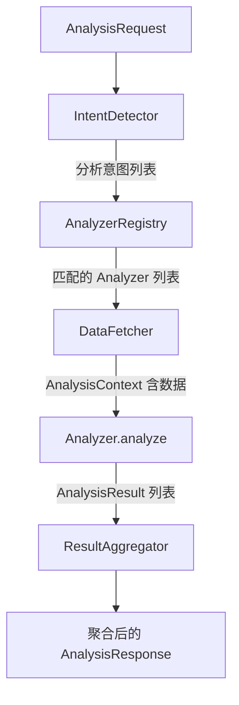

# 设计文档：OMS 运营分析引擎（oms_analysis_engine）

## 概述

oms_analysis_engine 是 OMS Agent 的运营分析引擎，以独立 Python 包形式实现。
对外是一个统一的 `oms_analysis` Skill，对内按能力域拆分为 15 个 Analyzer，
由 `OMSAnalysisEngine` 统一编排。

架构模式参考 oms_query_engine 的 Provider 模式，但将 Provider 概念替换为 Analyzer，
强调"分析"而非"查询"的语义。数据来源通过 oms_query 的 MCP tool 获取，不直接调用 OMS API。

### 设计目标

1. **顶层只编排**：OMSAnalysisEngine 不做具体分析逻辑，只负责意图识别 → Analyzer 调度 → 结果聚合
2. **Analyzer 自治**：每个 Analyzer 独立模块，实现 `BaseAnalyzer.analyze(context) → AnalysisResult`
3. **可插拔注册**：通过 AnalyzerRegistry 自动发现和加载 Analyzer，新增无需改 Engine
4. **数据间接获取**：通过 DataFetcher 调用 oms_query MCP tool，不直接调用 OMS API
5. **输出标准化**：所有 Analyzer 输出统一的 AnalysisResult 结构（含证据链、置信度、建议）
6. **算法版本管理**：每个 Analyzer 声明版本号，结果中携带版本信息

### 技术栈

- 语言：Python 3.11+
- 数据模型：Pydantic v2
- 数据来源：oms_query MCP tool（通过 DataFetcher 封装）
- 测试：pytest + hypothesis
- 无外部框架依赖

## 架构

### 系统上下文

```
用户分析请求（自然语言 / 结构化意图）
  → 【OMSAnalysisEngine】
       ├── IntentDetector     识别分析意图
       ├── AnalyzerRegistry   查找对应 Analyzer
       ├── DataFetcher        通过 MCP tool 获取数据
       ├── Analyzer(s)        执行分析逻辑
       └── ResultAggregator   聚合多个分析结果
  → AnalysisResult
  → 下游 Agent 展示
```

### 执行流水线



详细步骤：
1. **IntentDetector** — 从用户输入中识别分析意图（如 `root_cause`、`hold_analysis`、`inventory_health`）
2. **AnalyzerRegistry** — 根据意图查找已注册的 Analyzer 实例
3. **DataFetcher** — 根据 Analyzer 声明的数据需求，通过 oms_query MCP tool 批量获取数据，组装 AnalysisContext
4. **Analyzer.analyze(context)** — 各 Analyzer 独立执行分析，返回 AnalysisResult
5. **ResultAggregator** — 聚合多个 AnalysisResult，处理跨 Analyzer 的结论合并

### 模块划分

```
oms_analysis_engine/
├── __init__.py
├── engine.py                    # OMSAnalysisEngine 顶层编排
├── intent_detector.py           # 分析意图识别
├── analyzer_registry.py         # Analyzer 注册与发现
├── result_aggregator.py         # 结果聚合
├── base.py                      # BaseAnalyzer 接口
├── data_fetcher.py              # 通过 MCP tool / oms_query_engine 获取数据
│
├── analyzers/                   # 15 个 Analyzer
│   ├── __init__.py
│   ├── exception_root_cause.py  # 异常根因分析
│   ├── hold_analyzer.py         # Hold 原因分析
│   ├── stuck_order.py           # 卡单/阻塞诊断
│   ├── allocation_failure.py    # 分仓失败分析
│   ├── shipment_exception.py    # 发运异常分析
│   ├── batch_pattern.py         # 批量异常模式识别
│   ├── inventory_health.py      # 库存健康分析
│   ├── warehouse_efficiency.py  # 仓库效率分析
│   ├── channel_performance.py   # 渠道表现分析
│   ├── order_trend.py           # 订单趋势分析
│   ├── sku_sales.py             # SKU 销售分析
│   ├── fix_recommendation.py    # 修复建议生成
│   ├── replenishment_advisor.py # 补货建议生成
│   ├── impact_assessor.py       # 影响评估
│   └── cross_dimension.py       # 跨维度关联分析
│
├── models/                      # 数据模型
│   ├── __init__.py
│   ├── context.py               # AnalysisContext
│   ├── result.py                # AnalysisResult, Evidence, Recommendation
│   ├── request.py               # AnalysisRequest
│   └── enums.py                 # 异常分类、置信度、严重程度等枚举
│
└── data_fetcher.py              # 通过 MCP tool / oms_query_engine 获取数据
```


## 组件与接口

### 1. OMSAnalysisEngine（顶层编排器）

```python
class OMSAnalysisEngine:
    """OMS 运营分析引擎主入口。只负责编排，不做具体分析逻辑。"""

    def __init__(self, data_fetcher: DataFetcher | None = None):
        self._registry = AnalyzerRegistry()
        self._intent_detector = IntentDetector()
        self._data_fetcher = data_fetcher or DataFetcher()
        self._aggregator = ResultAggregator()
        # 自动注册所有内置 Analyzer
        self._registry.auto_discover()

    def analyze(self, request: AnalysisRequest) -> AnalysisResponse:
        """
        主分析入口。流水线：
        1. IntentDetector.detect(request) → list[AnalysisIntent]
        2. AnalyzerRegistry.resolve(intents) → list[BaseAnalyzer]
        3. DataFetcher.fetch(request, analyzers) → AnalysisContext
        4. 逐个 Analyzer.analyze(context) → list[AnalysisResult]
        5. ResultAggregator.aggregate(results) → AnalysisResponse
        """
        # 1. 意图识别
        intents = self._intent_detector.detect(request)

        # 2. 查找 Analyzer
        analyzers = self._registry.resolve(intents)

        # 3. 获取数据
        context = self._data_fetcher.fetch(request, analyzers)

        # 4. 执行分析
        results: list[AnalysisResult] = []
        for analyzer in analyzers:
            try:
                result = analyzer.analyze(context)
                results.append(result)
            except Exception as e:
                results.append(AnalysisResult.error_result(
                    analyzer_name=analyzer.name,
                    analyzer_version=analyzer.version,
                    error=str(e),
                ))

        # 5. 聚合结果
        return self._aggregator.aggregate(results, context)
```

### 2. BaseAnalyzer（Analyzer 接口）

```python
class BaseAnalyzer(ABC):
    """所有 Analyzer 的基类。"""

    # 子类必须声明
    name: str = "base"
    version: str = "1.0.0"
    intent: str = ""                          # 对应的分析意图标识
    required_data: list[str] = []             # 声明需要的数据类型

    @abstractmethod
    def analyze(self, context: AnalysisContext) -> AnalysisResult:
        """
        执行分析逻辑。
        - context: 包含订单数据、库存数据、规则数据等（由 DataFetcher 预填充）
        - 返回 AnalysisResult: 结论、证据链、置信度、建议等
        """
        ...

    def _build_evidence(self, source: str, description: str,
                        data: dict | None = None) -> Evidence:
        """构建证据对象的辅助方法。"""
        return Evidence(source=source, description=description, data=data)

    def _assess_confidence(self, evidences: list[Evidence]) -> Confidence:
        """根据证据数量和质量评估置信度。"""
        if not evidences:
            return Confidence.LOW
        high_priority = sum(1 for e in evidences
                           if e.source in ("status", "rule", "business_field"))
        if high_priority >= 2:
            return Confidence.HIGH
        if high_priority >= 1 or len(evidences) >= 2:
            return Confidence.MEDIUM
        return Confidence.LOW

    def _assess_data_completeness(self, context: AnalysisContext,
                                  required_fields: list[str]) -> DataCompleteness:
        """评估数据完整度。"""
        present = sum(1 for f in required_fields if context.has_data(f))
        ratio = present / len(required_fields) if required_fields else 0
        if ratio >= 0.9:
            return DataCompleteness.COMPLETE
        if ratio >= 0.5:
            return DataCompleteness.PARTIAL
        return DataCompleteness.INSUFFICIENT
```

### 3. AnalyzerRegistry（注册与发现）

```python
class AnalyzerRegistry:
    """Analyzer 注册中心。支持自动发现和手动注册。"""

    def __init__(self):
        self._analyzers: dict[str, BaseAnalyzer] = {}

    def register(self, analyzer: BaseAnalyzer) -> None:
        """手动注册一个 Analyzer。"""
        self._analyzers[analyzer.intent] = analyzer

    def unregister(self, intent: str) -> None:
        """注销一个 Analyzer。"""
        self._analyzers.pop(intent, None)

    def auto_discover(self) -> None:
        """
        自动发现 analyzers/ 目录下所有 BaseAnalyzer 子类并注册。
        扫描 oms_analysis_engine.analyzers 包中所有模块，
        找到 BaseAnalyzer 的子类并实例化注册。
        """
        ...

    def resolve(self, intents: list[AnalysisIntent]) -> list[BaseAnalyzer]:
        """根据意图列表返回匹配的 Analyzer 列表。"""
        return [self._analyzers[i.intent_type]
                for i in intents
                if i.intent_type in self._analyzers]

    def list_analyzers(self) -> dict[str, str]:
        """返回所有已注册 Analyzer 的 {intent: name} 映射。"""
        return {k: v.name for k, v in self._analyzers.items()}
```

### 4. IntentDetector（意图识别）

```python
class IntentDetector:
    """从用户请求中识别分析意图。"""

    # 意图关键词映射
    INTENT_KEYWORDS: dict[str, list[str]] = {
        "root_cause":          ["异常", "根因", "为什么失败", "exception"],
        "hold_analysis":       ["hold", "拦截", "为什么不动"],
        "stuck_order":         ["卡单", "阻塞", "停滞", "卡住"],
        "allocation_failure":  ["分仓失败", "没有分仓", "分仓异常"],
        "shipment_exception":  ["发运", "标签", "tracking", "同步失败"],
        "batch_pattern":       ["批量", "一批", "同类问题", "模式"],
        "inventory_health":    ["库存", "缺货", "积压", "可售天数"],
        "warehouse_efficiency":["仓库效率", "处理慢", "积压"],
        "channel_performance": ["渠道", "平台表现"],
        "order_trend":         ["趋势", "变化", "恶化"],
        "sku_sales":           ["销售", "热销", "滞销", "SKU"],
        "fix_recommendation":  ["怎么处理", "修复", "建议"],
        "replenishment":       ["补货", "补多少"],
        "impact_assessment":   ["影响", "严重程度", "优先级"],
        "cross_dimension":     ["关联", "共振", "跨维度"],
    }

    def detect(self, request: AnalysisRequest) -> list[AnalysisIntent]:
        """
        从请求中识别分析意图。
        - 若 request.intent 已明确指定，直接使用
        - 若为自然语言，通过关键词匹配识别
        - 返回按优先级排序的意图列表
        """
        ...
```

### 5. DataFetcher（数据获取层）

```python
class DataFetcher:
    """
    通过 oms_query MCP tool 获取分析所需数据。
    不直接调用 OMS API，而是复用 oms_query_engine 的查询能力。
    """

    def fetch(self, request: AnalysisRequest,
              analyzers: list[BaseAnalyzer]) -> AnalysisContext:
        """
        根据 Analyzer 声明的 required_data 批量获取数据。
        1. 合并所有 Analyzer 的数据需求
        2. 去重后通过 oms_query MCP tool 获取
        3. 组装为 AnalysisContext
        """
        ...

    def _fetch_order_data(self, identifier: str) -> dict | None:
        """获取订单数据（通过 oms_query tool）。"""
        ...

    def _fetch_inventory_data(self, sku: str,
                              merchant_no: str) -> dict | None:
        """获取库存数据。"""
        ...

    def _fetch_warehouse_data(self, merchant_no: str) -> dict | None:
        """获取仓库数据。"""
        ...

    def _fetch_batch_data(self, merchant_no: str,
                          filters: dict) -> list[dict]:
        """获取批量订单数据。"""
        ...

    def _apply_sampling(self, data: list[dict],
                        threshold: int = 1000) -> tuple[list[dict], SamplingInfo | None]:
        """
        大数据量降级：超过阈值时采样。
        返回 (采样后数据, 采样信息)。
        """
        ...
```

### 6. ResultAggregator（结果聚合）

```python
class ResultAggregator:
    """聚合多个 Analyzer 的分析结果。"""

    def aggregate(self, results: list[AnalysisResult],
                  context: AnalysisContext) -> AnalysisResponse:
        """
        聚合逻辑：
        1. 按 Analyzer 类型分组
        2. 合并证据链（去重）
        3. 取最高严重程度作为整体严重程度
        4. 合并建议列表（按优先级排序）
        5. 评估整体数据完整度
        """
        ...
```


### 7. Analyzer 职责清单

| Analyzer | 文件 | 意图标识 | 核心职责 |
|----------|------|---------|---------|
| ExceptionRootCauseAnalyzer | exception_root_cause.py | root_cause | 识别异常环节、归因、翻译为业务语言 |
| HoldAnalyzer | hold_analyzer.py | hold_analysis | 区分 Hold 来源、关联规则、输出解除条件 |
| StuckOrderAnalyzer | stuck_order.py | stuck_order | 计算停留时长、对比阈值、判定阻塞 |
| AllocationFailureAnalyzer | allocation_failure.py | allocation_failure | 逐层排除候选仓、区分库存/规则问题 |
| ShipmentExceptionAnalyzer | shipment_exception.py | shipment_exception | 识别发运异常子类型、判断可重试性 |
| BatchPatternAnalyzer | batch_pattern.py | batch_pattern | 按异常分组、寻找共性维度、判定批量模式 |
| InventoryHealthAnalyzer | inventory_health.py | inventory_health | 计算可售天数、健康等级、仓间分布 |
| WarehouseEfficiencyAnalyzer | warehouse_efficiency.py | warehouse_efficiency | 计算处理时长（均值+中位数）、异常率、排名 |
| ChannelPerformanceAnalyzer | channel_performance.py | channel_performance | 渠道订单量、异常率、履约时长对比 |
| OrderTrendAnalyzer | order_trend.py | order_trend | 趋势计算、环比变化、连续恶化预警 |
| SkuSalesAnalyzer | sku_sales.py | sku_sales | 销量排名、热销/滞销标签、仓间分布 |
| FixRecommendationAnalyzer | fix_recommendation.py | fix_recommendation | 基于分析结论匹配建议模板 |
| ReplenishmentAdvisor | replenishment_advisor.py | replenishment | 计算建议补货量、紧急程度 |
| ImpactAssessor | impact_assessor.py | impact_assessment | 计算影响范围、严重程度分级 |
| CrossDimensionAnalyzer | cross_dimension.py | cross_dimension | 计算交叉异常率、识别维度共振 |

## 数据模型

### models/enums.py — 枚举定义

```python
from enum import Enum

class Confidence(str, Enum):
    """置信度等级。"""
    HIGH = "high"       # 有明确状态/日志/规则直接支撑
    MEDIUM = "medium"   # 有主要证据但存在部分推断
    LOW = "low"         # 证据不足，仅可能性判断

class DataCompleteness(str, Enum):
    """数据完整度。"""
    COMPLETE = "complete"         # 关键字段完整
    PARTIAL = "partial"           # 部分缺失但可分析
    INSUFFICIENT = "insufficient" # 关键字段缺失

class Severity(str, Enum):
    """严重程度。"""
    CRITICAL = "critical"   # 受影响订单 > 100 或涉及核心 SKU
    MAJOR = "major"         # 受影响订单 10-100
    MINOR = "minor"         # 受影响订单 < 10

class Urgency(str, Enum):
    """紧急程度（补货场景）。"""
    URGENT = "urgent"       # 可售天数 < 3
    SUGGESTED = "suggested" # 3 ≤ 可售天数 < 7
    OPTIONAL = "optional"   # 可售天数 ≥ 7

class ExceptionCategory(str, Enum):
    """异常大类。"""
    INVENTORY = "inventory"
    RULE = "rule"
    WAREHOUSE = "warehouse"
    SHIPMENT = "shipment"
    SYNC = "sync"
    SYSTEM = "system"

class HoldSource(str, Enum):
    """Hold 来源类型。"""
    RULE = "rule"
    MANUAL = "manual"
    SYSTEM = "system"

class InventoryHealthLevel(str, Enum):
    """库存健康等级。"""
    OUT_OF_STOCK = "out_of_stock"
    LOW = "low"
    NORMAL = "normal"
    OVERSTOCK = "overstock"
```

### models/request.py — 请求模型

```python
class AnalysisRequest(BaseModel):
    """分析请求。"""
    identifier: str | None = None          # 订单号/SKU/仓库编码
    merchant_no: str | None = None
    intent: str | None = None              # 明确指定的分析意图
    query: str | None = None               # 自然语言查询
    time_range: TimeRange | None = None    # 时间范围
    filters: dict = Field(default_factory=dict)  # 额外过滤条件

class TimeRange(BaseModel):
    """时间范围。"""
    start: datetime
    end: datetime

class AnalysisIntent(BaseModel):
    """识别出的分析意图。"""
    intent_type: str       # 意图标识，如 "root_cause"
    confidence: float      # 意图识别置信度 0-1
    parameters: dict = Field(default_factory=dict)
```

### models/context.py — 分析上下文

```python
class AnalysisContext(BaseModel):
    """分析上下文，由 DataFetcher 填充。"""
    request: AnalysisRequest
    order_data: dict | None = None
    inventory_data: list[dict] = Field(default_factory=list)
    warehouse_data: list[dict] = Field(default_factory=list)
    rule_data: list[dict] = Field(default_factory=list)
    event_data: list[dict] = Field(default_factory=list)
    shipment_data: dict | None = None
    batch_orders: list[dict] = Field(default_factory=list)
    sampling_info: SamplingInfo | None = None

    def has_data(self, field: str) -> bool:
        """检查某个数据字段是否已填充。"""
        val = getattr(self, field, None)
        if val is None:
            return False
        if isinstance(val, list):
            return len(val) > 0
        return True

class SamplingInfo(BaseModel):
    """采样信息（大数据量降级时使用）。"""
    total_count: int
    sample_count: int
    sample_ratio: float
    method: str = "random"
```

### models/result.py — 分析结果

```python
class Evidence(BaseModel):
    """证据项。"""
    source: str                # 证据来源：status / rule / log / event / statistic / inference
    description: str           # 证据描述（业务语言）
    data: dict | None = None   # 原始数据片段

class Recommendation(BaseModel):
    """建议项。"""
    action: str                # 建议动作
    precondition: str | None = None  # 前置条件
    risk: str | None = None    # 风险提示
    priority: str = "medium"   # high / medium / low
    expected_effect: str | None = None

class AnalysisResult(BaseModel):
    """单个 Analyzer 的分析结果。"""
    analyzer_name: str
    analyzer_version: str
    success: bool = True
    summary: str = ""                          # 结论摘要
    reason: str = ""                           # 原因说明
    evidences: list[Evidence] = Field(default_factory=list)
    confidence: Confidence = Confidence.LOW
    data_completeness: DataCompleteness = DataCompleteness.INSUFFICIENT
    severity: Severity | None = None
    recommendations: list[Recommendation] = Field(default_factory=list)
    metrics: dict = Field(default_factory=dict)  # 域特定指标
    details: dict = Field(default_factory=dict)  # 域特定详情
    errors: list[str] = Field(default_factory=list)

    @classmethod
    def error_result(cls, analyzer_name: str, analyzer_version: str,
                     error: str) -> "AnalysisResult":
        return cls(
            analyzer_name=analyzer_name,
            analyzer_version=analyzer_version,
            success=False,
            summary=f"分析失败: {error}",
            errors=[error],
        )

class AnalysisResponse(BaseModel):
    """聚合后的分析响应。"""
    results: list[AnalysisResult] = Field(default_factory=list)
    overall_severity: Severity | None = None
    overall_confidence: Confidence = Confidence.LOW
    overall_data_completeness: DataCompleteness = DataCompleteness.INSUFFICIENT
    all_recommendations: list[Recommendation] = Field(default_factory=list)
    sampling_info: SamplingInfo | None = None
```


## 关键设计决策

| 决策 | 选择 | 理由 |
|------|------|------|
| Analyzer 粒度 | 15 个 Analyzer | 每个对应一个能力域，职责清晰，可独立迭代 |
| Analyzer 接口 | 统一 BaseAnalyzer.analyze(context) → AnalysisResult | 编排器不需要知道 Analyzer 内部实现 |
| 注册机制 | AnalyzerRegistry 自动发现 | 新增 Analyzer 无需修改 Engine 代码 |
| 数据获取 | DataFetcher 封装 MCP tool 调用 | 不直接调用 OMS API，复用 oms_query 能力 |
| 结果结构 | 统一 AnalysisResult（含证据链、置信度、建议） | 所有 Analyzer 输出格式一致，便于聚合和展示 |
| 置信度评估 | BaseAnalyzer 提供默认实现，子类可覆盖 | 统一评估逻辑，避免各 Analyzer 标准不一 |
| 大数据量降级 | DataFetcher 层采样，阈值 1000 条 | 在数据获取层统一处理，Analyzer 无需关心 |
| 算法版本 | 每个 Analyzer 声明 name + version | 便于 A/B 测试和算法迭代追溯 |
| 与 oms_query 的关系 | 数据消费者，不耦合内部实现 | 通过 MCP tool 接口获取数据，松耦合 |

## Correctness Properties

*A property is a characteristic or behavior that should hold true across all valid executions of a system — essentially, a formal statement about what the system should do. Properties serve as the bridge between human-readable specifications and machine-verifiable correctness guarantees.*

### Property 1: AnalysisResult 结构完整性

*For any* Analyzer 和 *any* 有效的 AnalysisContext，调用 `analyzer.analyze(context)` 返回的 AnalysisResult 必须满足：
- `analyzer_name` 非空且等于该 Analyzer 的 `name` 属性
- `analyzer_version` 非空且等于该 Analyzer 的 `version` 属性
- 当 `success=True` 时，`evidences` 列表非空

**Validates: Requirements AC-2, AC-16**

### Property 2: 置信度与数据完整度降级一致性

*For any* 证据列表 `evidences`，`_assess_confidence(evidences)` 的返回值必须满足：
- 当 `evidences` 为空时，返回 `Confidence.LOW`
- 当存在 ≥ 2 个高优先级证据（source 为 status/rule/business_field）时，返回 `Confidence.HIGH`
- 当存在 1 个高优先级证据或总证据数 ≥ 2 时，返回 `Confidence.MEDIUM`

*For any* AnalysisContext 和必需字段列表，`_assess_data_completeness` 的返回值必须满足：
- 字段覆盖率 ≥ 90% → `COMPLETE`
- 50% ≤ 覆盖率 < 90% → `PARTIAL`
- 覆盖率 < 50% → `INSUFFICIENT`

**Validates: Requirements AC-15, AC-17**

### Property 3: 异常分类映射完备性

*For any* 已知错误码（属于异常分类体系中的 `out_of_stock`, `inventory_locked`, `no_matching_rule`, `rule_conflict`, `warehouse_disabled`, `capacity_exceeded`, `label_failed`, `carrier_rejected`, `invalid_address`, `sync_rejected`, `auth_expired`, `timeout`, `internal_error`），ExceptionRootCauseAnalyzer 的分类逻辑必须将其映射到对应的 `ExceptionCategory` 大类，且映射结果与异常分类体系表一致。

**Validates: Requirements AC-3**

### Property 4: Hold 来源三分类

*For any* Hold 订单数据，HoldAnalyzer 的分析结果中 `hold_source` 必须为 `RULE`/`MANUAL`/`SYSTEM` 之一，且：
- 当存在规则命中记录时，分类为 `RULE`
- 当存在人工备注/人工操作标记时，分类为 `MANUAL`
- 当存在系统安全拦截标记时，分类为 `SYSTEM`

**Validates: Requirements AC-4**

### Property 5: 停留时长计算与超时判定

*For any* 环节开始时间 `start_time`、当前时间 `now` 和阈值 `threshold`（均为正数），StuckOrderAnalyzer 的计算必须满足：
- `duration = now - start_time`
- `is_stuck = (duration > threshold)`
- `overtime_ratio = duration / threshold`
- 当 `is_stuck=True` 时，`overtime_ratio > 1.0`
- 当 `is_stuck=False` 时，`overtime_ratio ≤ 1.0`

**Validates: Requirements AC-5**

### Property 6: 分仓失败原因区分

*For any* 候选仓集合、库存数据和规则数据，AllocationFailureAnalyzer 的分析结果必须满足：
- 当所有候选仓的库存满足率均为 0% 时，失败原因归类为"库存问题"
- 当存在库存满足率 ≥ 100% 的候选仓但被规则排除时，失败原因归类为"规则问题"

**Validates: Requirements AC-6**

### Property 7: 发运异常可重试性标注

*For any* 发运异常错误码，ShipmentExceptionAnalyzer 的分析结果必须包含 `retryable` 字段，且：
- 临时性错误（timeout, internal_error）标注为 `retryable=True`
- 永久性错误（invalid_address, carrier_rejected）标注为 `retryable=False`

**Validates: Requirements AC-7**

### Property 8: 批量模式阈值不变量

*For any* 异常订单集合，BatchPatternAnalyzer 的分析结果必须满足：
- 当某类异常的去重订单数 ≤ 3 时，该类不被标记为批量异常模式
- 当某类异常的去重订单数 > 3 时，该类可以被标记为批量异常模式

**Validates: Requirements AC-8**

### Property 9: 可售天数计算正确性

*For any* 当前可用库存 `stock`（≥ 0）和日均消耗量 `daily_consumption`（≥ 0），InventoryHealthAnalyzer 的可售天数计算必须满足：
- 当 `stock = 0` 时，可售天数 = 0
- 当 `daily_consumption = 0` 且 `stock > 0` 时，可售天数标记为"无法计算"（不为 0）
- 当 `daily_consumption > 0` 且 `stock > 0` 时，可售天数 = `stock / daily_consumption`

**Validates: Requirements AC-9**

### Property 10: 仓库效率统计双指标

*For any* 非空的仓库订单处理时长列表 `durations`，WarehouseEfficiencyAnalyzer 的输出必须同时包含：
- `mean_duration` = `sum(durations) / len(durations)`
- `median_duration` = 排序后的中位数值
- 两个值均为非负数

**Validates: Requirements AC-10**

### Property 11: 低样本渠道降级

*For any* 渠道订单数据，当某渠道的订单量低于最小样本阈值时，ChannelPerformanceAnalyzer 的输出中该渠道的置信度不为 `HIGH`。

**Validates: Requirements AC-11**

### Property 12: 连续恶化预警判定

*For any* 日异常率时间序列 `[d1, d2, d3, ...]`，OrderTrendAnalyzer 的预警判定必须满足：
- 当存在连续 3 天 `d_i < d_{i+1} < d_{i+2}` 时，触发连续上升预警
- 当不存在连续 3 天递增时，不触发连续上升预警

**Validates: Requirements AC-12**

### Property 13: 补货量计算与紧急程度

*For any* 当前可用库存 `stock`、日均消耗量 `consumption` 和目标库存天数 `target_days`（均 ≥ 0），ReplenishmentAdvisor 的计算必须满足：
- `suggested_qty = max(0, target_days × consumption - stock)`
- 当可售天数 < 3 时，紧急程度 = `URGENT`
- 当 3 ≤ 可售天数 < 7 时，紧急程度 = `SUGGESTED`
- 当可售天数 ≥ 7 时，紧急程度 = `OPTIONAL`

**Validates: Requirements AC-14**

### Property 14: 大数据量采样降级

*For any* 数据列表，DataFetcher 的 `_apply_sampling` 方法必须满足：
- 当 `len(data) ≤ 1000` 时，返回原始数据且 `SamplingInfo` 为 None
- 当 `len(data) > 1000` 时，返回采样数据且 `SamplingInfo` 非 None
- 采样后 `SamplingInfo.total_count = len(原始数据)`
- 采样后 `SamplingInfo.sample_count = len(采样数据)`
- 采样后 `SamplingInfo.sample_ratio = sample_count / total_count`

**Validates: Requirements AC-18**

## Error Handling

### 错误处理策略

| 场景 | 处理方式 |
|------|---------|
| 单个 Analyzer 执行异常 | 捕获异常，生成 error_result，不阻断其他 Analyzer |
| DataFetcher 获取数据失败 | 标记对应数据字段为 None，Analyzer 通过 data_completeness 降级 |
| 意图识别无匹配 | 返回空 AnalysisResponse，附带提示信息 |
| Analyzer 未注册 | 跳过该意图，日志记录 warning |
| 数据量超阈值 | DataFetcher 自动采样，结果中标注 SamplingInfo |
| 关键字段缺失 | Analyzer 内部检查，降级为 LOW 置信度或标记 INSUFFICIENT |
| 计算除零 | 可售天数等场景特殊处理（见 AC-9），不抛异常 |

### 降级策略

```
数据完整 → 正常分析（HIGH/MEDIUM 置信度）
部分缺失 → 有限分析（MEDIUM/LOW 置信度）+ 标注缺失字段
关键缺失 → 无法分析（LOW 置信度）+ 明确说明原因
```

## Testing Strategy

### 测试方法

采用双轨测试策略：

1. **Property-Based Tests（属性测试）**
   - 使用 Hypothesis 库
   - 每个属性测试最少 100 次迭代
   - 覆盖 14 个 Correctness Properties
   - 每个测试标注对应的 Property 编号
   - 标签格式：`Feature: oms-analysis-skill, Property {N}: {title}`

2. **Example-Based Unit Tests（示例测试）**
   - 覆盖各 Analyzer 的典型业务场景
   - 覆盖边界条件（空数据、极端值）
   - 覆盖错误处理路径
   - 验证 AnalyzerRegistry 的注册/发现机制

### 测试重点

| 测试类型 | 覆盖范围 |
|---------|---------|
| Property Tests | 计算正确性（可售天数、补货量、停留时长、均值/中位数）、分类正确性（异常分类、Hold来源、可重试性）、阈值判定（批量模式、低样本降级、采样降级）、结构不变量（版本号、证据链） |
| Unit Tests | 各 Analyzer 典型场景、IntentDetector 关键词匹配、DataFetcher 数据组装、ResultAggregator 合并逻辑、AnalyzerRegistry 自动发现 |
| Integration Tests | Engine 端到端流水线、DataFetcher 与 MCP tool 交互 |

### PBT 库选择

- 库：[Hypothesis](https://hypothesis.readthedocs.io/)（Python 生态最成熟的 PBT 库）
- 配置：`@settings(max_examples=100)`
- 自定义 Strategy：为 AnalysisContext、Evidence、异常订单数据等生成随机实例
