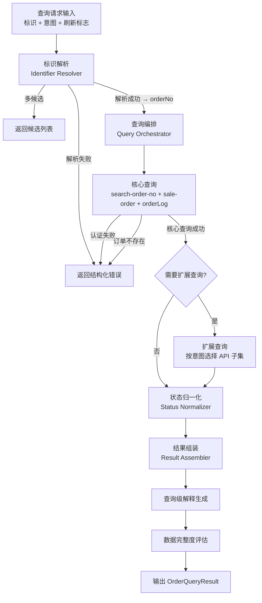

# 设计文档：订单全景查询引擎（order_query_engine）

## 概述

order_query_engine 是 OMS Agent 的核心查询引擎，以独立 Python 包形式实现（遵循 cartonization_engine/ 的架构模式）。引擎接收用户提供的任意订单标识（orderNo / shipmentNo / trackingNo / eventId），通过分层查询编排策略调用 OMS staging API，将 25+ 种原始订单状态归一化为统一中文业务术语，明确区分异常（Exception）与暂停履约（Hold），输出标准化的 `OrderQueryResult` 结构供下游 skill 复用。

### 设计目标

1. **准确性**：状态归一化零偏差，Exception 与 Hold 严格互斥
2. **高效性**：分层查询编排，简单问题只调核心 API，避免不必要的网络开销
3. **健壮性**：扩展查询失败不阻断核心结果，优雅降级
4. **可复用性**：输出 OrderQueryResult 结构稳定，下游 skill 直接消费
5. **可测试性**：纯逻辑模块（标识解析、状态归一化、结果组装）与 I/O 模块（API 客户端）分离

### 技术栈

- 语言：Python 3.11+
- 数据模型：Pydantic v2（JSON 序列化/反序列化 + 字段验证）
- HTTP 客户端：requests（与现有 query_oms.py 一致）
- 测试：pytest + hypothesis（属性测试）
- 无外部框架依赖，作为独立模块运行

## 架构

### 系统上下文

```
用户输入标识 → 【order_query_engine】 → OrderQueryResult → 下游 skill / Agent 展示
                                                          ├─ order_analysis（根因分析）
                                                          ├─ warehouse_allocation（仓库推荐）
                                                          ├─ shipping_rate（运费计算）
                                                          └─ cartonization（装箱计算）
```

### 执行流水线



### 模块划分

| 模块文件 | 类/职责 | 对应需求 |
|----------|---------|----------|
| `models.py` | 所有 Pydantic 数据模型 | 需求 7, 11, 12 |
| `config.py` | 环境配置（Base URL、账号、租户、商户） | 需求 12 |
| `api_client.py` | `OMSAPIClient` — 认证、HTTP 调用、重试、超时 | 需求 1 |
| `cache.py` | `QueryCache` — 内存字典 + TTL 缓存 | 需求 8 |
| `identifier_resolver.py` | `IdentifierResolver` — 模式匹配 + API 反查 | 需求 2 |
| `status_normalizer.py` | `StatusNormalizer` — status_code → 中文业务状态 | 需求 4 |
| `query_orchestrator.py` | `QueryOrchestrator` — 意图检测 + 核心/扩展查询调度 | 需求 3 |
| `result_assembler.py` | `ResultAssembler` — 多 API 结果合并 + 查询级解释 | 需求 5, 6, 7 |
| `errors.py` | 结构化错误类型定义 | 需求 9 |
| `engine.py` | `OrderQueryEngine` — 顶层编排入口 | 全部 |


## 组件与接口

### 1. 引擎入口 (`OrderQueryEngine`)

```python
class OrderQueryEngine:
    """订单全景查询引擎主入口，协调各子模块完成完整查询流程。"""

    def __init__(self, config: EngineConfig | None = None):
        self._config = config or EngineConfig()
        self._client = OMSAPIClient(self._config)
        self._cache = QueryCache()
        self._resolver = IdentifierResolver(self._client, self._cache)
        self._orchestrator = QueryOrchestrator(self._client, self._cache)
        self._normalizer = StatusNormalizer()
        self._assembler = ResultAssembler(self._normalizer)

    def query(self, request: QueryRequest) -> OrderQueryResult:
        """
        查询主入口。
        流程：标识解析 → 查询编排 → 状态归一化 → 结果组装 → 输出。
        """
        ...

    def query_batch(self, request: BatchQueryRequest) -> BatchQueryResult:
        """批量查询：状态统计或按状态过滤的订单列表。"""
        ...
```

### 2. 环境配置 (`EngineConfig`)

```python
class EngineConfig(BaseModel):
    """引擎环境配置，集中管理所有外部依赖参数。"""
    base_url: str = "https://omsv2-staging.item.com"
    username: str = "lantester@item.com"
    password: str = "LANLT"
    tenant_id: str = "LT"
    merchant_no: str = "LAN0000002"
    request_timeout: int = 15          # 秒
    token_refresh_buffer: int = 30     # token 提前刷新秒数
```

### 3. API 客户端 (`OMSAPIClient`)

```python
class OMSAPIClient:
    """封装 OMS staging 环境的 HTTP 调用，负责认证和请求管理。"""

    def __init__(self, config: EngineConfig):
        self._config = config
        self._token: str | None = None
        self._token_expires_at: float = 0  # Unix timestamp

    def authenticate(self) -> str:
        """使用 password grant 获取 access_token。"""
        ...

    def get(self, path: str, params: dict | None = None) -> dict:
        """发送 GET 请求，自动处理认证和 token 刷新。"""
        ...

    def post(self, path: str, data: dict | None = None) -> dict:
        """发送 POST 请求，自动处理认证和 token 刷新。"""
        ...

    def _ensure_token(self) -> None:
        """检查 token 有效性，剩余有效期 < 30s 时自动刷新。"""
        ...

    def _headers(self) -> dict:
        """构建请求头：Authorization + x-tenant-id + Content-Type。"""
        ...
```

### 4. 查询缓存 (`QueryCache`)

```python
class QueryCache:
    """内存字典 + TTL 缓存，同一 workflow 内避免重复 API 调用。"""

    def __init__(self):
        self._store: dict[str, tuple[float, Any]] = {}  # key → (expires_at, value)

    def get(self, key: str) -> Any | None:
        """获取缓存值，过期返回 None。"""
        ...

    def set(self, key: str, value: Any, ttl: int) -> None:
        """设置缓存值和 TTL（秒）。"""
        ...

    def invalidate_all(self) -> None:
        """清除所有缓存（用户要求刷新时调用）。"""
        ...
```

TTL 策略：
| 缓存对象 | TTL | 说明 |
|----------|-----|------|
| access_token | expires_in - 30s | 提前过期避免请求失败 |
| 订单详情 / 日志列表 | 60s | 同一订单短时间不重复查 |
| 仓库 / 规则 / Hold 规则 | 300s | 变化频率低 |

### 5. 标识解析器 (`IdentifierResolver`)

```python
class IdentifierResolver:
    """识别输入标识类型并解析为 orderNo。"""

    # 模式匹配规则
    PATTERNS = {
        "orderNo": r"^(SO|PO|WO)",       # SO/PO/WO 开头
        "shipmentNo": r"^SH",             # SH 开头
        "eventId": r"^evt_|^\d+$",        # evt_ 前缀或纯数字
    }

    # API 反查优先级
    FALLBACK_ORDER = ["orderNo", "eventId", "shipmentNo", "trackingNo"]

    def __init__(self, client: OMSAPIClient, cache: QueryCache):
        self._client = client
        self._cache = cache

    def resolve(self, input_value: str) -> ResolveResult:
        """
        解析标识：
        1. 正则模式匹配 → 直接识别类型
        2. 不匹配 → 按优先级依次调用 search-order-no API 反查
        3. 多候选 → 返回候选列表
        4. 全部失败 → 返回解析失败错误
        """
        ...
```

### 6. 状态归一化器 (`StatusNormalizer`)

```python
class StatusNormalizer:
    """将 OMS 原始 status_code 映射为统一中文业务状态。"""

    # 完整映射表（25 个状态码）
    STATUS_MAP: dict[int, StatusMapping] = {
        0:  StatusMapping(main_status="已导入", category="初始", is_exception=False, is_hold=False),
        1:  StatusMapping(main_status="已分仓", category="正常", is_exception=False, is_hold=False),
        # ... 完整 25 个映射
        10: StatusMapping(main_status="异常", category="异常", is_exception=True, is_hold=False),
        16: StatusMapping(main_status="暂停履约", category="Hold", is_exception=False, is_hold=True),
    }

    def normalize(self, status_code: int) -> NormalizedStatus:
        """
        归一化状态码。
        已知状态码 → 查表返回。
        未知状态码 → 返回"未知状态({code})"，分类"未知"。
        """
        ...
```

### 7. 查询编排器 (`QueryOrchestrator`)

```python
class QueryOrchestrator:
    """根据用户意图决定调用哪些 API，执行核心查询和扩展查询。"""

    # 意图 → 扩展 API 映射
    INTENT_API_MAP = {
        "shipment":   ["tracking_detail", "fulfillment_orders", "tracking_status"],
        "warehouse":  ["warehouse_list", "deallocate_query"],
        "rule":       ["routing_rules", "custom_rules", "sku_warehouse"],
        "inventory":  ["inventory_list"],
        "hold":       ["hold_rules"],
        "timeline":   ["order_timeline"],
        "panorama":   None,  # 全部扩展查询
    }

    def __init__(self, client: OMSAPIClient, cache: QueryCache):
        self._client = client
        self._cache = cache

    def execute_core(self, order_no: str) -> CoreQueryResult:
        """执行核心查询：search-order-no + sale-order + orderLog。"""
        ...

    def execute_extended(self, order_no: str, intents: list[str],
                         core_result: CoreQueryResult) -> ExtendedQueryResult:
        """根据意图执行扩展查询，缓存命中时跳过 API 调用。"""
        ...

    def detect_intents(self, query_intent: str) -> list[str]:
        """从用户查询意图字符串中检测需要的扩展查询类别。"""
        ...
```

意图检测关键词映射：
| 关键词 | 意图类别 |
|--------|----------|
| shipment / 追踪 / 发运 | shipment |
| 仓库 / 分仓 | warehouse |
| 规则 / 策略 | rule |
| 库存 | inventory |
| Hold / 暂停 | hold |
| 时间线 / 事件 | timeline |
| 全景 | panorama |
| 状态（无其他关键词） | 仅核心查询 |

### 8. 结果组装器 (`ResultAssembler`)

```python
class ResultAssembler:
    """将多个 API 返回合并为 OrderQueryResult，生成查询级解释。"""

    def __init__(self, normalizer: StatusNormalizer):
        self._normalizer = normalizer

    def assemble(self, core: CoreQueryResult,
                 extended: ExtendedQueryResult | None,
                 query_input: QueryInput) -> OrderQueryResult:
        """
        合并核心查询和扩展查询结果为 OrderQueryResult。
        - 未调用的 API → 对应字段设为 None
        - 调用失败的 API → 对应字段设为 None + 记录到 missing_fields
        - 生成查询级解释
        - 评估数据完整度
        """
        ...

    def _build_explanation(self, status: NormalizedStatus,
                           core: CoreQueryResult,
                           extended: ExtendedQueryResult | None) -> QueryExplanation:
        """
        生成查询级解释：
        - Hold → why_hold（规则名称 + 触发条件）
        - Exception → why_exception（异常事件类型 + 时间）
        - 已分仓 → why_this_warehouse（分仓策略 + 命中规则）
        - current_step（基于主状态描述当前业务步骤）
        仅描述现象，不做根因推断。
        """
        ...

    def _assess_completeness(self, core_success: bool,
                             extended_failures: list[str]) -> DataCompleteness:
        """
        评估数据完整度：
        - 核心查询全部成功 + 扩展查询全部成功 → "full"
        - 核心查询成功 + 部分扩展失败 → "partial"
        - 核心查询失败 → "minimal"
        """
        ...
```

### 9. 错误定义 (`errors.py`)

```python
class QueryError(Exception):
    """查询引擎基础错误。"""
    def __init__(self, error_type: str, message: str, context: dict | None = None):
        self.error_type = error_type  # auth_failed / not_found / api_error / network_error / resolve_failed
        self.message = message
        self.context = context or {}

class AuthenticationError(QueryError):
    def __init__(self, status_code: int, response_summary: str): ...

class OrderNotFoundError(QueryError):
    def __init__(self, order_no: str): ...

class APICallError(QueryError):
    def __init__(self, path: str, status_code: int, response_summary: str): ...

class NetworkTimeoutError(QueryError):
    def __init__(self, url: str): ...

class IdentifierResolveError(QueryError):
    def __init__(self, input_value: str, tried_types: list[str]): ...
```


## 数据模型

所有数据模型使用 Pydantic v2 定义，支持 JSON 序列化/反序列化。

### 请求模型

```python
class QueryRequest(BaseModel):
    """单订单查询请求。"""
    identifier: str                          # 任意标识值
    query_intent: str = "status"             # 查询意图：status / shipment / warehouse / rule / inventory / hold / timeline / panorama
    force_refresh: bool = False              # 是否跳过缓存

class BatchQueryRequest(BaseModel):
    """批量查询请求。"""
    query_type: str                          # "status_count" / "order_list"
    status_filter: int | None = None         # 按状态过滤
    page_no: int = 1
    page_size: int = 20
```

### 标识解析模型

```python
class QueryInput(BaseModel):
    """记录标识解析过程。"""
    input_value: str
    identified_type: str | None = None       # orderNo / shipmentNo / trackingNo / eventId
    resolved_order_no: str | None = None

class ResolveResult(BaseModel):
    """标识解析结果。"""
    success: bool
    query_input: QueryInput | None = None
    candidates: list[str] | None = None      # 多候选时返回
    error: QueryError | None = None
```

### 状态模型

```python
class StatusMapping(BaseModel):
    """状态码映射条目。"""
    main_status: str                         # 中文主状态名
    category: str                            # 分类：初始/正常/终态/逆向/异常/Hold/特殊/过渡/未知
    is_exception: bool = False
    is_hold: bool = False

class NormalizedStatus(BaseModel):
    """归一化后的状态。"""
    status_code: int
    main_status: str
    category: str
    is_exception: bool
    is_hold: bool
```

### 查询中间模型

```python
class CoreQueryResult(BaseModel):
    """核心查询结果（3 个 API 的原始返回）。"""
    search_result: dict | None = None
    order_detail: dict | None = None
    order_logs: dict | None = None
    success: bool = False
    errors: list[str] = Field(default_factory=list)

class ExtendedQueryResult(BaseModel):
    """扩展查询结果。"""
    tracking_detail: dict | None = None
    fulfillment_orders: dict | None = None
    tracking_status: dict | None = None
    warehouse_list: dict | None = None
    deallocate_info: dict | None = None
    routing_rules: dict | None = None
    custom_rules: dict | None = None
    sku_warehouse_rules: dict | None = None
    inventory: dict | None = None
    hold_rules: dict | None = None
    timeline: dict | None = None
    failed_apis: list[str] = Field(default_factory=list)
    called_apis: list[str] = Field(default_factory=list)
```

### 输出模型（OrderQueryResult）

```python
class OrderIdentity(BaseModel):
    order_no: str | None = None
    customer_order_no: str | None = None
    external_order_no: str | None = None
    merchant_no: str | None = None
    channel_no: str | None = None
    channel_name: str | None = None

class OrderContext(BaseModel):
    order_type: str | None = None            # standard / sample / cross_border / replacement
    order_type_tags: list[str] | None = None
    related_order_no: str | None = None
    order_source: str | None = None

class CurrentStatus(BaseModel):
    main_status: str | None = None
    fulfillment_status: str | None = None
    shipment_status: str | None = None
    is_exception: bool | None = None
    is_hold: bool | None = None
    hold_reason: str | None = None
    exception_reason: str | None = None

class OrderItem(BaseModel):
    sku: str
    quantity: int
    description: str | None = None
    weight: float | None = None
    dimensions: str | None = None

class ShippingAddress(BaseModel):
    country: str | None = None
    state: str | None = None
    city: str | None = None
    zipcode: str | None = None
    address1: str | None = None

class ShipmentInfo(BaseModel):
    shipment_no: str | None = None
    carrier_name: str | None = None
    carrier_scac: str | None = None
    delivery_service: str | None = None
    tracking_no: str | None = None
    shipment_status: str | None = None

class InventoryInfo(BaseModel):
    sku_inventory: list[dict] | None = None
    inventory_summary: str | None = None

class WarehouseInfo(BaseModel):
    allocated_warehouse: str | None = None
    warehouse_name: str | None = None
    warehouse_accounting_code: str | None = None

class AllocationInfo(BaseModel):
    allocation_reason: str | None = None
    dispatch_strategies: list[str] | None = None
    filter_strategies: list[str] | None = None
    backup_strategy: str | None = None

class RuleInfo(BaseModel):
    routing_rules: list[dict] | None = None
    custom_rules: list[dict] | None = None
    hold_rules: list[dict] | None = None
    sku_warehouse_rules: list[dict] | None = None

class EventInfo(BaseModel):
    timeline: list[dict] | None = None
    latest_event_type: str | None = None
    latest_event_time: str | None = None
    order_logs: list[dict] | None = None

class QueryExplanation(BaseModel):
    current_step: str | None = None
    why_hold: str | None = None
    why_exception: str | None = None
    why_this_warehouse: str | None = None

class DataCompleteness(BaseModel):
    completeness_level: str = "minimal"      # full / partial / minimal
    missing_fields: list[str] = Field(default_factory=list)
    data_sources: list[str] = Field(default_factory=list)

class OrderQueryResult(BaseModel):
    """订单全景查询标准化输出。"""
    query_input: QueryInput
    order_identity: OrderIdentity | None = None
    order_context: OrderContext | None = None
    current_status: CurrentStatus | None = None
    order_items: list[OrderItem] | None = None
    shipping_address: ShippingAddress | None = None
    shipment_info: ShipmentInfo | None = None
    inventory_info: InventoryInfo | None = None
    warehouse_info: WarehouseInfo | None = None
    allocation_info: AllocationInfo | None = None
    rule_info: RuleInfo | None = None
    event_info: EventInfo | None = None
    query_explanation: QueryExplanation | None = None
    data_completeness: DataCompleteness = Field(default_factory=DataCompleteness)
    error: dict | None = None                # 结构化错误信息（查询失败时）

class BatchQueryResult(BaseModel):
    """批量查询结果。"""
    status_counts: dict[str, int] | None = None
    orders: list[dict] | None = None
    total: int = 0
    page_no: int = 1
    page_size: int = 20
```

### 关键设计决策

| 决策 | 选择 | 理由 |
|------|------|------|
| 数据模型库 | Pydantic v2 | 与 cartonization_engine 一致，内置 JSON 序列化、字段验证 |
| HTTP 客户端 | requests | 与现有 query_oms.py 一致，简单可靠 |
| 缓存方案 | 内存字典 + TTL | 引擎生命周期内有效，无需外部依赖 |
| 标识解析策略 | 正则优先 + API 反查兜底 | 减少不必要的 API 调用，提高解析速度 |
| 查询编排 | 意图驱动分层 | 避免每次调用全部 24 个 API，节省网络开销 |
| 状态归一化 | 静态映射表 | 25 个状态码固定，查表 O(1)，易维护 |
| 错误处理 | 结构化错误类型 | 每种错误携带上下文，便于上层处理和展示 |
| 输出字段可空 | 所有扩展字段 Optional | 未调用或调用失败的 API 对应字段为 None，不填充虚假数据 |

