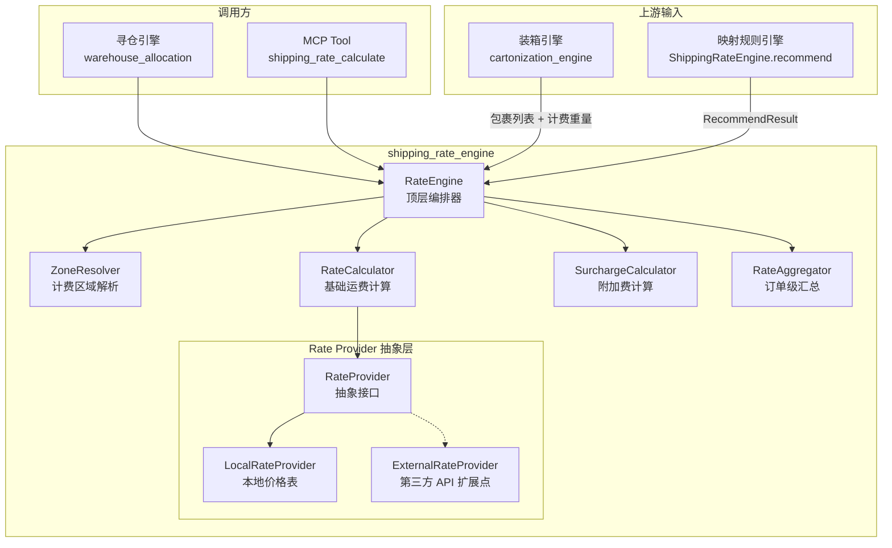
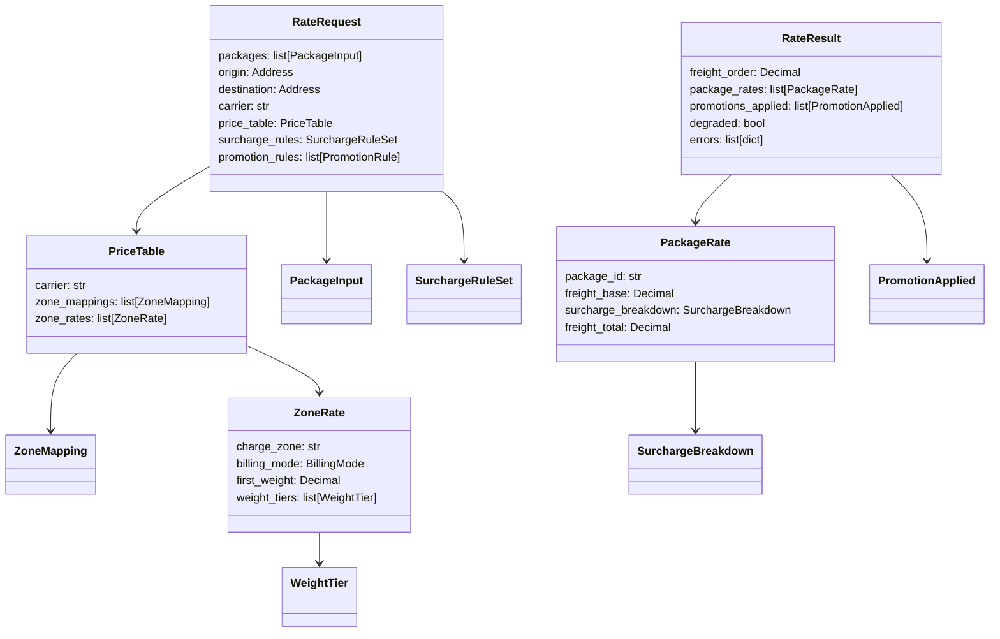
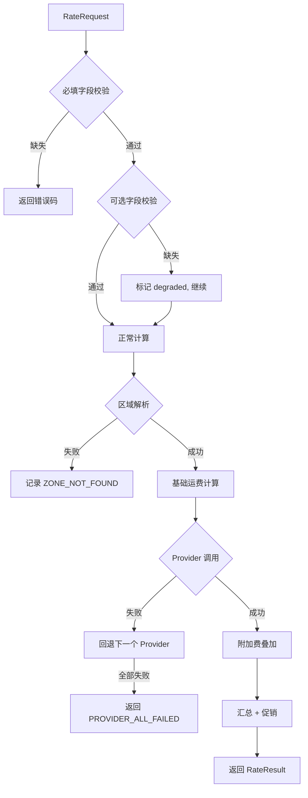

# Design Document — Shipping Rate Engine（运费计算引擎）

## Overview

运费计算引擎（Rate Engine）是 shipping_rate skill 的核心扩展，在现有三层映射规则引擎（承运商/服务推荐）基础上，增加真正的运费计算能力。引擎接收装箱引擎输出的包裹列表和映射引擎确定的承运商信息，基于价格表配置计算每个包裹的基础运费和附加费，汇总为订单级运费，并应用促销减免。

运费计算是 warehouse_allocation 综合评分（Score 公式）的核心输入之一，其输出 `Freight_order` 直接参与 `Cost_total` 计算。

### 设计目标

1. 支持 4 种计费模式：首重+续重、阶梯重量、体积计费、固定费用
2. 支持 8 种附加费，按 5 步顺序叠加
3. 纯函数式计算核心，不依赖外部 I/O，便于测试和复用
4. 通过 `Rate_Provider` 抽象接口预留第三方 API 扩展点
5. 与现有映射规则引擎无缝整合，接受 `RecommendResult` 作为输入
6. 通过 MCP tool 暴露给 OMS Agent

### 关键设计决策

| 决策 | 选择 | 理由 |
|------|------|------|
| 计算核心是否纯函数 | 是 | 纯函数便于 PBT 测试，无副作用，可并行计算多承运商方案 |
| 价格表数据来源 | 本地配置 + Provider 抽象 | MVP 用本地 JSON/dict 配置，未来通过 Provider 对接 API |
| 附加费叠加方式 | 有序 pipeline | PRD 明确 5 步顺序，节假日附加费依赖燃油附加费结果 |
| 金额精度 | Decimal + round(2) | 避免浮点误差，所有金额保留 2 位小数 |
| 与映射引擎关系 | 组合而非继承 | Rate Engine 接受映射结果作为输入，不修改映射引擎代码 |

## Architecture

### 系统架构



### 计算流水线


## Components and Interfaces

### 1. RateEngine（顶层编排器）

扩展现有 `ShippingRateEngine`，新增 `calculate_rate()` 方法。

```python
class ShippingRateEngine:
    """现有：query / execute / recommend"""
    """新增：calculate_rate"""
    
    def calculate_rate(self, request: RateRequest) -> RateResult:
        """运费计算主入口"""
        # 1. 输入验证
        # 2. 遍历每个包裹
        #    a. 区域解析
        #    b. 基础运费计算
        #    c. 附加费叠加（5 步 pipeline）
        # 3. 订单级汇总
        # 4. 促销减免
        ...
    
    def calculate_rate_multi(
        self, request: RateRequest, recommendations: list[CarrierRecommendation]
    ) -> list[RateResult]:
        """为多个承运商推荐分别计算运费"""
        ...
```

### 2. ZoneResolver（计费区域解析器）

纯函数，根据发货仓地址和收货地址确定计费区域。

```python
class ZoneResolver:
    @staticmethod
    def resolve(
        origin: Address,
        destination: Address,
        zone_mappings: list[ZoneMapping],
    ) -> str:
        """返回 charge_zone 编号。
        匹配优先级：区级 > 市级 > 省级。
        同城返回同城区域编号。
        """
        ...
```

### 3. RateCalculator（基础运费计算器）

纯函数，支持 4 种计费模式。

```python
class RateCalculator:
    @staticmethod
    def calculate(
        billing_weight: Decimal,
        volume_cm3: Decimal | None,
        zone_rate: ZoneRate,
    ) -> Decimal:
        """根据 zone_rate.billing_mode 分派到对应计费函数"""
        ...
    
    @staticmethod
    def calc_first_weight_step(billing_weight: Decimal, zone_rate: ZoneRate) -> Decimal:
        """首重+续重模式"""
        ...
    
    @staticmethod
    def calc_weight_tier(billing_weight: Decimal, zone_rate: ZoneRate) -> Decimal:
        """阶梯重量模式"""
        ...
    
    @staticmethod
    def calc_volume(volume_cm3: Decimal, zone_rate: ZoneRate) -> Decimal:
        """体积计费模式"""
        ...
    
    @staticmethod
    def calc_fixed(zone_rate: ZoneRate) -> Decimal:
        """固定费用模式"""
        ...
```

### 4. SurchargeCalculator（附加费计算器）

纯函数，按 5 步顺序叠加 8 种附加费。

```python
class SurchargeCalculator:
    @staticmethod
    def calculate_all(
        freight_base: Decimal,
        package: PackageInput,
        surcharge_rules: SurchargeRuleSet,
        context: SurchargeContext,
    ) -> SurchargeBreakdown:
        """按 5 步顺序叠加所有附加费，返回明细"""
        ...
    
    # 8 种附加费的独立计算方法
    @staticmethod
    def calc_fuel(freight_base: Decimal, fuel_rate: Decimal) -> Decimal: ...
    @staticmethod
    def calc_remote(freight_base: Decimal, rule: RemoteSurchargeRule, is_remote: bool) -> Decimal: ...
    @staticmethod
    def calc_overweight(billing_weight: Decimal, rule: OverweightSurchargeRule) -> Decimal: ...
    @staticmethod
    def calc_oversize(max_edge: Decimal, rule: OversizeSurchargeRule) -> Decimal: ...
    @staticmethod
    def calc_cold_chain(has_cold_items: bool, rule: ColdChainSurchargeRule) -> Decimal: ...
    @staticmethod
    def calc_insurance(declared_value: Decimal, rule: InsuranceSurchargeRule) -> Decimal: ...
    @staticmethod
    def calc_stair(floor: int, is_bulky: bool, has_elevator: bool, rule: StairSurchargeRule) -> Decimal: ...
    @staticmethod
    def calc_holiday(base_plus_fuel: Decimal, rule: HolidaySurchargeRule, is_holiday: bool) -> Decimal: ...
```

### 5. RateAggregator（运费汇总器）

纯函数，汇总包裹运费并应用促销减免。

```python
class RateAggregator:
    @staticmethod
    def aggregate(
        package_rates: list[PackageRate],
        promotion_rules: list[PromotionRule],
        order_total_amount: Decimal | None = None,
    ) -> OrderRateSummary:
        """汇总订单运费，应用促销减免"""
        ...
```

### 6. RateProvider（抽象接口）

```python
from abc import ABC, abstractmethod

class RateProvider(ABC):
    @abstractmethod
    def get_rate(
        self,
        package: PackageInput,
        origin: Address,
        destination: Address,
        carrier: str,
    ) -> ProviderRateResult:
        """获取单包裹运费"""
        ...
    
    @property
    @abstractmethod
    def priority(self) -> int:
        """优先级，数字越小优先级越高"""
        ...

class LocalRateProvider(RateProvider):
    """基于本地价格表的运费计算"""
    def __init__(self, price_tables: dict[str, PriceTable]): ...
    
class ExternalRateProvider(RateProvider):
    """第三方承运商 API 扩展点（预留）"""
    ...
```


## Data Models

所有数据模型使用 Pydantic BaseModel 定义，支持 JSON 序列化/反序列化。

### 输入模型

```python
from decimal import Decimal
from enum import Enum
from pydantic import BaseModel, Field

class BillingMode(str, Enum):
    FIRST_WEIGHT_STEP = "first_weight_step"  # 首重+续重
    WEIGHT_TIER = "weight_tier"              # 阶梯重量
    VOLUME = "volume"                        # 体积计费
    FIXED = "fixed"                          # 固定费用

class SurchargeType(str, Enum):
    REMOTE = "remote"           # 偏远地区
    OVERWEIGHT = "overweight"   # 超重
    OVERSIZE = "oversize"       # 超尺寸
    FUEL = "fuel"               # 燃油
    HOLIDAY = "holiday"         # 节假日
    INSURANCE = "insurance"     # 保价
    COLD_CHAIN = "cold_chain"   # 冷链
    STAIR = "stair"             # 上楼

class SurchargeChargeMode(str, Enum):
    FIXED_AMOUNT = "fixed_amount"    # 固定金额
    PERCENTAGE = "percentage"        # 百分比

class Address(BaseModel):
    province: str = ""
    city: str = ""
    district: str = ""
    country: str = "CN"

class PackageInput(BaseModel):
    """单包裹输入（来自装箱引擎输出）"""
    package_id: str
    billing_weight: Decimal          # 计费重量 kg
    actual_weight: Decimal           # 实际重量 kg
    volume_cm3: Decimal | None = None  # 体积 cm³
    length_cm: Decimal | None = None
    width_cm: Decimal | None = None
    height_cm: Decimal | None = None
    items: list[dict] = Field(default_factory=list)  # SKU 列表
    has_cold_items: bool = False      # 是否含冷藏/冷冻商品
    is_bulky: bool = False            # 是否大件
    declared_value: Decimal = Decimal("0")  # 声明价值

class ZoneMapping(BaseModel):
    """区域映射规则"""
    origin_province: str = ""
    origin_city: str = ""
    origin_district: str = ""
    dest_province: str = ""
    dest_city: str = ""
    dest_district: str = ""
    charge_zone: str               # 计费区域编号

class WeightTier(BaseModel):
    """阶梯重量区间"""
    min_weight: Decimal            # 区间下限 kg（含）
    max_weight: Decimal | None     # 区间上限 kg（不含），None 表示无上限
    unit_price: Decimal            # 该区间单价 元/kg

class ZoneRate(BaseModel):
    """单个计费区域的费率配置"""
    charge_zone: str
    billing_mode: BillingMode
    # 首重+续重参数
    first_weight: Decimal = Decimal("1")
    first_weight_fee: Decimal = Decimal("0")
    step_weight: Decimal = Decimal("1")
    step_weight_fee: Decimal = Decimal("0")
    # 阶梯重量参数
    weight_tiers: list[WeightTier] = Field(default_factory=list)
    # 体积计费参数
    unit_price_per_m3: Decimal = Decimal("0")
    # 固定费用参数
    fixed_fee: Decimal = Decimal("0")

class PriceTable(BaseModel):
    """承运商价格表"""
    carrier: str
    zone_mappings: list[ZoneMapping] = Field(default_factory=list)
    zone_rates: list[ZoneRate] = Field(default_factory=list)

class SurchargeRule(BaseModel):
    """单条附加费规则"""
    surcharge_type: SurchargeType
    charge_mode: SurchargeChargeMode = SurchargeChargeMode.FIXED_AMOUNT
    # 通用参数
    fixed_amount: Decimal = Decimal("0")
    percentage: Decimal = Decimal("0")
    # 特定类型参数
    threshold: Decimal = Decimal("0")       # 阈值（超重阈值/超尺寸阈值/保价阈值）
    overweight_unit_price: Decimal = Decimal("0")  # 超重单价
    per_floor_price: Decimal = Decimal("0")        # 楼层单价
    remote_areas: list[str] = Field(default_factory=list)  # 偏远地区列表
    holiday_periods: list[dict] = Field(default_factory=list)  # 节假日期间

class SurchargeRuleSet(BaseModel):
    """附加费规则集"""
    rules: list[SurchargeRule] = Field(default_factory=list)

class PromotionRule(BaseModel):
    """促销运费规则"""
    rule_name: str
    min_order_amount: Decimal = Decimal("0")  # 最低订单金额
    discount_type: str = "full_free"           # full_free / fixed_discount / percentage_discount
    discount_amount: Decimal = Decimal("0")
    discount_percentage: Decimal = Decimal("0")

class RateRequest(BaseModel):
    """运费计算请求"""
    packages: list[PackageInput]
    origin: Address
    destination: Address
    carrier: str
    price_table: PriceTable | None = None
    surcharge_rules: SurchargeRuleSet = Field(default_factory=SurchargeRuleSet)
    promotion_rules: list[PromotionRule] = Field(default_factory=list)
    merchant_agreement: dict = Field(default_factory=dict)
    # 附加费上下文
    ship_date: str | None = None          # 发货日 YYYY-MM-DD
    estimated_delivery_date: str | None = None  # 预计送达日
    has_elevator: bool = True
    floor_number: int = 0
    order_total_amount: Decimal | None = None
    # 映射引擎来源
    recommend_source: str | None = None   # one_to_one / condition_mapping / shipping_mapping
```

### 输出模型

```python
class SurchargeDetail(BaseModel):
    """单项附加费明细"""
    surcharge_type: SurchargeType
    amount: Decimal = Decimal("0")
    triggered: bool = False
    reason: str = ""

class SurchargeBreakdown(BaseModel):
    """附加费汇总"""
    fuel: Decimal = Decimal("0")
    remote: Decimal = Decimal("0")
    overweight: Decimal = Decimal("0")
    oversize: Decimal = Decimal("0")
    cold_chain: Decimal = Decimal("0")
    insurance: Decimal = Decimal("0")
    stair: Decimal = Decimal("0")
    holiday: Decimal = Decimal("0")
    total: Decimal = Decimal("0")
    details: list[SurchargeDetail] = Field(default_factory=list)

class PackageRate(BaseModel):
    """单包裹运费明细"""
    package_id: str
    charge_zone: str = ""
    billing_mode: BillingMode | None = None
    freight_base: Decimal = Decimal("0")
    surcharge_breakdown: SurchargeBreakdown = Field(default_factory=SurchargeBreakdown)
    freight_total: Decimal = Decimal("0")  # freight_base + surcharge_total

class PromotionApplied(BaseModel):
    """促销减免明细"""
    rule_name: str
    discount_amount: Decimal = Decimal("0")

class RateResult(BaseModel):
    """运费计算结果"""
    success: bool = True
    freight_order: Decimal = Decimal("0")          # 订单级运费（减免后）
    freight_order_before_promotion: Decimal = Decimal("0")  # 减免前
    package_rates: list[PackageRate] = Field(default_factory=list)
    promotions_applied: list[PromotionApplied] = Field(default_factory=list)
    total_promotion_discount: Decimal = Decimal("0")
    degraded: bool = False
    degraded_fields: list[str] = Field(default_factory=list)
    errors: list[dict] = Field(default_factory=list)  # [{"code": "...", "message": "..."}]
    carrier: str = ""
    recommend_source: str | None = None
    confidence: str = "high"
    calculation_explanation: str = ""
```

### 模型关系图




## Correctness Properties

*A property is a characteristic or behavior that should hold true across all valid executions of a system — essentially, a formal statement about what the system should do. Properties serve as the bridge between human-readable specifications and machine-verifiable correctness guarantees.*

### Property 1: Input validation correctness

*For any* RateRequest with one or more required fields (packages, billing_weight, origin, destination, carrier, price_table) set to None or empty, the Rate_Engine SHALL return an error result containing the correct error code for each missing field, and SHALL NOT return a successful freight calculation.

**Validates: Requirements 1.1, 1.2, 1.3, 1.4**

### Property 2: Graceful degradation on missing optional rules

*For any* RateRequest where packages, addresses, carrier, and price_table are valid but surcharge_rules, promotion_rules, or merchant_agreement are missing, the Rate_Engine SHALL produce a successful RateResult with `degraded=True` and a non-empty `degraded_fields` list.

**Validates: Requirements 1.5**

### Property 3: Zone resolution with hierarchical priority

*For any* set of ZoneMapping entries with overlapping coverage at province/city/district levels, the ZoneResolver SHALL select the most specific match (district > city > province). Additionally, *for any* origin and destination in the same city, the resolver SHALL return the same-city zone.

**Validates: Requirements 2.1, 2.2, 2.4**

### Property 4: First weight + step formula correctness

*For any* valid billing_weight > 0 and ZoneRate with billing_mode=first_weight_step, the RateCalculator SHALL compute `freight_base = first_weight_fee + ceil((ceil(weight*10)/10 - first_weight) / step_weight) * step_weight_fee` when weight > first_weight, and `freight_base = first_weight_fee` when weight <= first_weight. The result SHALL be rounded to 2 decimal places.

**Validates: Requirements 3.1, 3.2, 3.3, 3.4, 3.5**

### Property 5: Tiered weight formula correctness

*For any* valid billing_weight > 0 and ZoneRate with billing_mode=weight_tier containing N tiers, the RateCalculator SHALL compute the sum of `min(weight_in_tier, tier_range) * tier_unit_price` for each tier. When billing_weight exceeds the maximum tier, the excess SHALL be charged at the highest tier's unit_price.

**Validates: Requirements 4.1, 4.2, 4.3, 4.4**

### Property 6: Volume formula correctness

*For any* valid volume_cm3 > 0 and ZoneRate with billing_mode=volume, the RateCalculator SHALL compute `freight_base = (volume_cm3 / 1_000_000) * unit_price_per_m3`, rounded to 2 decimal places.

**Validates: Requirements 5.1, 5.2, 5.3**

### Property 7: All monetary amounts have exactly 2 decimal places

*For any* valid RateRequest that produces a successful RateResult, every monetary field in the result (freight_base, each surcharge amount, freight_total, freight_order, discount_amount) SHALL have at most 2 decimal places.

**Validates: Requirements 3.5, 4.4, 5.3, 6.2, 10.3, 16.3**

### Property 8: Conditional surcharge trigger correctness

*For any* PackageInput and SurchargeRuleSet:
- Remote surcharge SHALL be > 0 if and only if the destination is in the remote_areas list
- Overweight surcharge SHALL be > 0 if and only if billing_weight > overweight threshold
- Oversize surcharge SHALL be > 0 if and only if max_edge > oversize threshold

**Validates: Requirements 7.1, 7.3, 8.1, 8.2, 9.1, 9.2**

### Property 9: Fuel surcharge formula

*For any* freight_base >= 0 and fuel_surcharge_rate >= 0, the fuel surcharge SHALL equal `round(freight_base * fuel_surcharge_rate, 2)`, and SHALL always be computed (never skipped).

**Validates: Requirements 10.1, 10.2, 10.3**

### Property 10: Service surcharge trigger correctness

*For any* PackageInput and SurchargeRuleSet:
- Insurance fee SHALL be > 0 if and only if declared_value > insurance threshold
- Cold chain surcharge SHALL be > 0 if and only if has_cold_items is True
- Stair fee SHALL be > 0 if and only if is_bulky is True AND has_elevator is False AND floor_number > 0

**Validates: Requirements 12.1, 12.2, 13.1, 13.2, 14.1, 14.2**

### Property 11: Holiday surcharge uses correct base

*For any* freight_base and fuel_surcharge where a holiday surcharge with percentage mode is triggered, the holiday surcharge SHALL be computed as `round((freight_base + fuel_surcharge) * holiday_percentage, 2)`, NOT as `round(freight_base * holiday_percentage, 2)`.

**Validates: Requirements 11.2, 15.2**

### Property 12: Surcharge pipeline ordering

*For any* RateRequest where all 8 surcharge types are triggered, the SurchargeCalculator SHALL compute surcharges in the 5-step order: (1) base freight → (2) fuel → (3) remote/overweight/oversize → (4) cold_chain/insurance/stair → (5) holiday. Surcharges in steps 3 and 4 SHALL be independent of each other (computing them in any order within the step produces the same total).

**Validates: Requirements 15.1, 15.3**

### Property 13: Order aggregation sum

*For any* list of PackageRate objects, the RateAggregator SHALL compute `freight_order = sum(pkg.freight_total for pkg in package_rates)`, and the output SHALL contain exactly one PackageRate entry per input package.

**Validates: Requirements 16.1, 16.2, 16.3**

### Property 14: Promotion discount with non-negative floor

*For any* freight_order_before_promotion >= 0 and any list of PromotionRule objects, the RateAggregator SHALL ensure `freight_order >= 0` after applying all discounts. The total_promotion_discount SHALL not exceed freight_order_before_promotion.

**Validates: Requirements 17.1, 17.2**

### Property 15: Data model round-trip serialization

*For any* valid RateRequest, RateResult, or PriceTable object, serializing to JSON and deserializing back SHALL produce an object equal to the original.

**Validates: Requirements 18.5, 18.6, 19.4**

### Property 16: Multi-recommendation rate calculation

*For any* list of N CarrierRecommendation objects passed to calculate_rate_multi, the engine SHALL return exactly N RateResult objects, and each result SHALL preserve the recommend_source from the corresponding recommendation.

**Validates: Requirements 20.2, 20.3**

### Property 17: Provider chain with priority fallback

*For any* ordered list of RateProvider instances, the RateEngine SHALL invoke providers in ascending priority order. If a provider raises an error, the engine SHALL fall back to the next provider. If all providers fail, the engine SHALL return an error result.

**Validates: Requirements 21.3, 21.4**

## Error Handling

### 错误码定义

| 错误码 | 触发条件 | 处理方式 |
|--------|----------|----------|
| `MISSING_PACKAGE_INFO` | 包裹列表为空或计费重量缺失 | 阻断，返回错误 |
| `PRICE_TABLE_NOT_FOUND` | 承运商价格表未找到 | 阻断，返回错误 |
| `MISSING_ADDRESS` | 发货仓或收货地址缺失 | 阻断，返回错误 |
| `ZONE_NOT_FOUND` | 无法匹配计费区域 | 阻断该包裹，记录错误 |
| `INVALID_BILLING_MODE` | 价格表中计费模式无效 | 阻断该包裹，记录错误 |
| `PROVIDER_ALL_FAILED` | 所有 RateProvider 均失败 | 阻断，返回错误 |

### 降级策略

| 缺失数据 | 策略 | degraded_fields 标记 |
|----------|------|---------------------|
| surcharge_rules 缺失 | 使用空规则集，不计算附加费 | `["surcharge_rules"]` |
| promotion_rules 缺失 | 不做促销减免 | `["promotion_rules"]` |
| merchant_agreement 缺失 | 忽略商家协议 | `["merchant_agreement"]` |
| volume_cm3 缺失（体积计费模式） | 回退到首重+续重模式 | `["volume_cm3"]` |

### 异常处理流程



## Testing Strategy

### 测试框架

- 单元测试：pytest
- 属性测试：hypothesis（Python PBT 库）
- 每个属性测试最少 100 次迭代

### 属性测试（Property-Based Testing）

基于上述 17 个 Correctness Properties，使用 hypothesis 实现属性测试。每个属性测试标注对应的设计属性编号。

标签格式：`Feature: shipping-rate-engine, Property {N}: {title}`

重点属性测试：
1. 4 种计费模式的公式正确性（Property 4, 5, 6）
2. 附加费触发条件和计算正确性（Property 8, 9, 10）
3. 附加费叠加顺序（Property 12）
4. 金额 2 位小数不变量（Property 7）
5. 促销减免非负下限（Property 14）
6. 数据模型 round-trip 序列化（Property 15）

### 单元测试（Example-Based）

针对 PRD 7.6.8 和 7.6.9 中的典型案例编写具体示例测试：
- 案例 1-5：不同承运商和计费模式的基础运费
- 多包裹订单运费计算（PRD 7.6.9 典型案例）
- 固定费用模式（Requirement 6.1）
- MCP tool 集成测试（Requirement 22）

### 测试目录结构

```
tests/
  test_props_rate_calculator.py    # Property 4, 5, 6, 7 — 基础运费计算
  test_props_surcharge.py          # Property 8, 9, 10, 11, 12 — 附加费
  test_props_aggregator.py         # Property 13, 14 — 汇总和促销
  test_props_zone_resolver.py      # Property 3 — 区域解析
  test_props_rate_models.py        # Property 15 — 数据模型 round-trip
  test_props_rate_engine.py        # Property 1, 2, 16, 17 — 引擎级属性
  test_rate_examples.py            # 示例测试 — PRD 案例
  test_rate_integration.py         # 集成测试 — MCP tool
```
