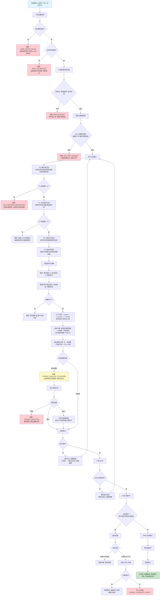

---
模块迭代记录:
  - 版本: v1.1
    日期: 2026-04-03
    变更: 按功能域合并模块文件
  - 版本: v1.0
    日期: 2026-04-03
    变更: 初始版本，从主 PRD 拆分
---

# 业务流程

以下为智能分仓决策引擎的端到端全景业务流程，覆盖从订单接入到最终履约完成的完整链路。

```mermaid
flowchart TD
    A[外部触点: AI指令 / API / 文件导入] --> B[订单前置校验]
    B --> B1{地址解析成功?}
    B1 -- 否 --> B1X[阻断: ADDR_PARSE_FAILED<br/>挂起至异常池, 等待人工补全地址]
    B1 -- 是 --> B2{必填字段完整?}
    B2 -- 否 --> B2X[阻断: INPUT_INCOMPLETE<br/>返回缺失字段清单, 等待补全]
    B2 -- 是 --> C[订单前置风控拦截]

    C --> C1{黑名单 / 恶意刷单 / 欺诈检测}
    C1 -- 命中 --> C1X[阻断: RISK_BLOCKED<br/>转异常工单, 通知风控团队]
    C1 -- 通过 --> D[商品主数据校验]

    D --> D1{SKU 主数据完整?<br/>重量/尺寸/温区/禁混标签}
    D1 -- 缺失 --> D1X[阻断: SKU_DATA_MISSING<br/>通知商家补全, 挂起订单]
    D1 -- 完整 --> E[进入寻源漏斗]

    E --> E1[P0: 硬约束过滤<br/>仓状态/库存/配送范围/温区/合规/物理可发]
    E1 --> E1C{P0 候选集 > 0?}
    E1C -- 否 --> E1X[阻断: NO_CANDIDATE_WAREHOUSE<br/>全部仓被淘汰, 记录各仓淘汰原因]
    E1C -- 是 --> E2[P1: 业务条件过滤<br/>截单时间/仓容量/承运商时效]
    E2 --> E2C{P1 候选集 > 0?}
    E2C -- 否 --> E2X[降级: 放宽 SLA 约束重试<br/>或挂起等待次日截单窗口]
    E2C -- 是 --> E3[P2: 多维评分排序<br/>成本/时效/容量/稳定性加权]
    E3 --> E4[P3: 稳定性兜底<br/>粘性/冷却期/切仓频率/容量均衡]

    E4 --> F[方案枚举与求解]
    F --> F1[枚举: 单仓直发 vs 多仓拆发 vs 调拨合发]
    F1 --> F2[装箱计算: 箱型选择 / 禁混校验 / 超规检测]
    F2 --> F2C{装箱可行?}
    F2C -- 否 --> F2X[降级: 拆包重算 或 超大件走专线]
    F2C -- 是 --> F3[ETA 计算: T_queue + T_process + T_transit<br/>混合校准, 风险化口径]
    F3 --> F4[成本计算: 运费阶梯首续重 + 仓操费 + 拆单惩罚<br/>综合成本函数 TotalCost]
    F4 --> F5[输出最优方案: 仓 + 承运商 + 包裹方案 + ETA + 成本]

    F5 --> G{财务熔断检查}
    G -- 触发熔断 --> G1[阻断: FINANCE_BREAKER_TRIGGERED<br/>运费/客单价超阈值, 或毛利为负]
    G1 --> G2[进入审批队列]
    G2 --> G2A{审批结果}
    G2A -- 通过 --> H
    G2A -- 拒绝 --> G2X[阻断: FINANCE_REJECTED<br/>通知商家, 建议调整方案]
    G2A -- 超时 --> G2T[自动升级通知链<br/>超过2小时按兜底方案执行]
    G2T --> H
    G -- 未触发 --> H[库存预占]

    H --> H1{预占成功?}
    H1 -- 否 --> H1X[重试3次, 指数退避<br/>仍失败 → 排除当前仓, 触发重算]
    H1X --> E
    H1 -- 是 --> I[下发 WMS]

    I --> I1{WMS 接收成功?}
    I1 -- 否 --> I1X[释放预占库存<br/>排除当前仓, 触发重算]
    I1X --> E
    I1 -- 是 --> J[WMS 履约中]

    J --> J1{逆向事件?<br/>用户取消/改地址/改商品}
    J1 -- 是 --> K[逆向拦截]
    K --> K1{当前状态}
    K1 -- 运算中/待审核 --> K1A[直接作废, 释放资源]
    K1 -- 已锁库/已下发 --> K1B[发起 WMS 拦截]
    K1B --> K1BC{拦截成功?}
    K1BC -- 是 --> K1B1[释放库存, 重新进入决策<br/>或确认取消]
    K1BC -- 否 --> K1B2[转人工处理<br/>CANCEL_INTERCEPT_FAILED]
    J1 -- 否 --> L[WMS 出库确认]

    L --> M[物流运输中]
    M --> N[签收确认]
    N --> O[已完成: 结算触发, 释放预占凭证, 归档决策日志]

    style A fill:#e1f5fe
    style O fill:#c8e6c9
    style B1X fill:#ffcdd2
    style B2X fill:#ffcdd2
    style C1X fill:#ffcdd2
    style D1X fill:#ffcdd2
    style E1X fill:#ffcdd2
    style G1 fill:#fff9c4
    style G2X fill:#ffcdd2
    style K1B2 fill:#ffcdd2
```
